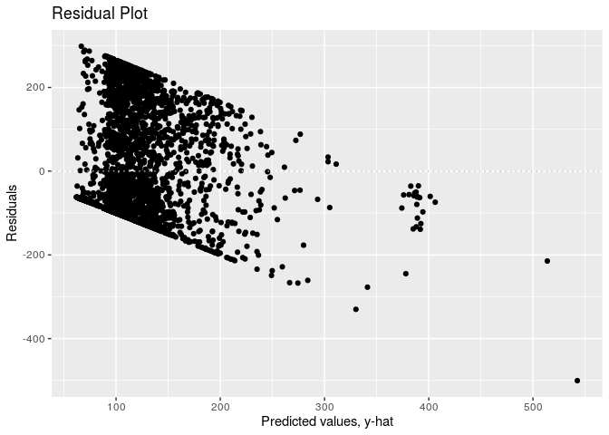
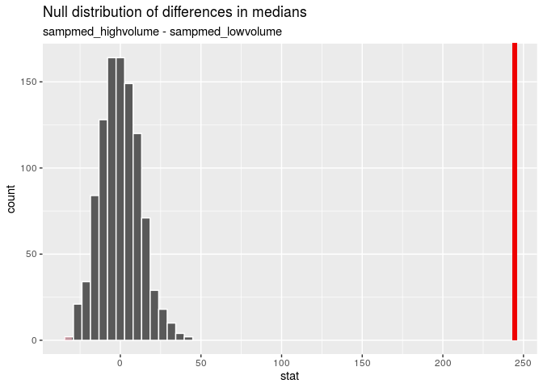

NYC Airbnb Popularity Factors
================
WORLD
12/3/2019

### Load packages & data

Loaded the following packages that will be needed to perform analysis:

``` r
library(tidyverse) 
library(infer)
library(openintro)
library(dplyr)
library(knitr)
library(broom)
library(tidytext)
```

Uploaded the Airbnb data set from Kaggle via a csv file:

``` r
abnb <- read_csv("AB_NYC_2019.csv")
```

We are assuming that the data we have for Airbnbs in New York City
represents the population given that a) there are 48,895 observations
and b) we consulted Dr. Tackett and she thinks that the data was most
likely web scapped from the Airbnb website.

Therefore, in order to perform analysis, we created a sample set called
abnb\_sample of 4000 randomly selected observations.

``` r
set.seed(111519)
abnb_sample <- sample_n(abnb, 4000)
```

It is important to note that we were advised that our exploratory data
analysis should involve the entire dataset while our conclusions should
be drawn from the sample.

### Part I: Price and Location

In part I, the following research question will be examined: How does
location (borough and co-ordinates, for example) influence the price of
a listing?

### Understanding Price

To start, a bootstrap distribution was constructed for the median price
of Airbnbs in NYC. This will help to better understand the range of
prices and the real estate landscape that the true median price would be
within.

``` r
set.seed(111519)
boot_dist_median_price <- abnb_sample %>%
  specify(response = price) %>%
  generate(reps = 1000, type = "bootstrap") %>%
  calculate(stat = "median")
```

Creating a 95% bootstrap confidence interval for the the median price of
Airbnbs in NYC:

``` r
(ci_bounds <- get_ci(boot_dist_median_price, level= 0.95))
```

    ## # A tibble: 1 x 2
    ##   `2.5%` `97.5%`
    ##    <dbl>   <dbl>
    ## 1    100     110

Creating a visualizaing of the bootstrap distribution for median price:

``` r
visualize(boot_dist_median_price) + 
  labs(title = "Bootstrap Distribution of Median Price") +
  shade_ci(ci_bounds)
```

<!-- -->

As depicted in the output and visualization, we are 95% confident that
the population median price per night of Airbnbs in NYC is between
$100.00 and $110.00. This information will help us understand prices in
the Airbnb market as we go about attempting to draw comparisions.

### Exploring Boroughs

The first location variable that might be helpful to explore is borough
(neighbourhood\_group) given that New York City is divided into five
areas (The Bronx, Brooklyn, Manhattan, Queens, and Staten Island).

Creating an exploratory bar graph that displays number of listings by
borough in New York City:

``` r
ggplot(data = abnb, mapping = aes(x = neighbourhood_group)) +
  geom_bar() + 
  labs(title = "Listings by Borough", x = "Borough", y = "Count")
```

<!-- -->

Manhattan and Brooklyn dominate the number of listings on Airbnb in New
York City. More specifically, there is roughly 20,000 listings in
Brooklyn and slightly more than 20,000 listings in Manhattan. Queens
follows after with roughly 5,000 listings, followed by the Bronx and
Staten Island with fewer than 1,100 listings each.

Calculating summary statistics that will count the number of listings in
each neighborhood group:

``` r
abnb %>%
  count(neighbourhood_group) %>%
  arrange(desc(n))
```

    ## # A tibble: 5 x 2
    ##   neighbourhood_group     n
    ##   <chr>               <int>
    ## 1 Manhattan           21661
    ## 2 Brooklyn            20104
    ## 3 Queens               5666
    ## 4 Bronx                1091
    ## 5 Staten Island         373

Manhattan has the most listings at 21,661 followed by Brooklyn at 20,104
listings, followed by Queens at 5,666, Bronx at 1,091, and Staten Island
last at only 373 listings.

Creating summary statistics that displays the median price of each
neighborhood group.

``` r
abnb %>%
  group_by(neighbourhood_group) %>%
  summarise(med_price = median(price)) %>%
  arrange(desc(med_price)) %>%
  head(5)
```

    ## # A tibble: 5 x 2
    ##   neighbourhood_group med_price
    ##   <chr>                   <dbl>
    ## 1 Manhattan                 150
    ## 2 Brooklyn                   90
    ## 3 Queens                     75
    ## 4 Staten Island              75
    ## 5 Bronx                      65

Manhattan has the highest median price at 150 followed by Brooklyn at
90, Queens and Staten Island at 75, and the Bronx last at 65. We will
develop a linear model to describe how boroughs influence price and,
since Manhattan had the largest volume of Airbnbs and the highest median
price, that will be the baseline for comparison with other boroughs.

Using fct\_relevel to make Manhattan the baseline level for
neighbourhood\_group:

``` r
abnb_sample <- abnb_sample %>%
  mutate(neighbourhood_group = fct_relevel(neighbourhood_group, 
                                           "Manhattan", 
                                           "Brooklyn",
                                           "Staten Island",
                                           "Queens",
                                           "Bronx"))
```

Creating a linear model to predict Airbnb price by borough. It is first
important to discuss the assumptions we are making when performing this
regression. We are assuming each listing is independent because the
pricing of one space does not driectly influence the other. While some
might argue there is dependence between listings to some extent, the
market for Airbnbs in NYC is free and competitive so renters, ideally,
don’t collude.

``` r
lm_price_borough <- lm(price ~ neighbourhood_group, data = abnb_sample)
```

In addition to independence, there are other assumptions that need to be
discussed. Thus, a residuals plot will be made:

``` r
lm_price_borough_aug <- augment(lm_price_borough)
ggplot(data = lm_price_borough_aug, aes(x = .fitted, y = .resid)) +
  geom_point() +
  geom_hline(yintercept = 0, lty = 3, color = "gray") +
  labs(y = "Residuals", 
       x = "Predicted values, y-hat", 
       title = "Residual Plot")
```

<!-- -->

As the predicted values increase, the spread of the residuals increase
in a “fan” like shape. This violates the constant variance assumption
needed for regression. Therefore, we will proceed with caution when
drawing assumptions from the linear regression.

As depicted in the normality of residuals graph below, the residuals are
randomly distributed around 0.

``` r
ggplot(data = lm_price_borough_aug, aes(x = .resid)) +
  geom_histogram(binwidth = 300) +
  labs(x = "Residuals", 
       title = "Normality of Residuals")
```

<!-- -->

However, the residuals are not nearly normally distributed. Therefore,
we will filter out outliers to filtered when take out outliers to get a
filtered normality of residuals graph that has a nearly normal
distribution.

``` r
lm_price_borough_aug_filter <- lm_price_borough_aug %>%
  filter(.resid <= 250 & .resid >= -170 )

ggplot(data = lm_price_borough_aug_filter, aes(x = .resid)) +
  geom_histogram(binwidth = 100) +
  labs(x = "Residuals", 
       title = "Filtered Normality of Residuals")
```

<!-- -->

Using tidy to show the output for the linear model:

``` r
lm_price_borough %>% 
  tidy() %>% 
  select(term, estimate, p.value) %>%
  kable(format = "markdown", digits =3)
```

| term                              |  estimate | p.value |
| :-------------------------------- | --------: | ------: |
| (Intercept)                       |   206.848 |   0.000 |
| neighbourhood\_groupBrooklyn      |  \-85.106 |   0.000 |
| neighbourhood\_groupStaten Island | \-117.674 |   0.019 |
| neighbourhood\_groupQueens        | \-110.432 |   0.000 |
| neighbourhood\_groupBronx         | \-126.213 |   0.000 |

The linear model is:

`price-hat = 206.848 -85.106*(neighbourhood_groupBrooklyn)
-117.674*(neighbourhood_groupStaten Island)
-110.432*(neighbourhood_groupQueens) -126.213(neighbourhood_groupBronx)`

Given that the Airbnb is in Manhattan, the expected median price, on
average, is $206.85. In this case, the intercept does have a meaningful
interpretation because an Airbnb could have a price of $206.85 per
night.

The median price for the other boroughs in relation in Manhattan is:

For an Airbnb in Brooklyn, the median price is expected, on average, to
be $85.11 less than an Airbnb in Manhattan, holding all else constant.

For an Airbnb in Staten Island, the median price is expected, on
average, to be $117.67 less than an Airbnb in Manhattan, holding all
else constant.

For an Airbnb in Queens, the median price is expected, on average, to be
$110.43 less than an Airbnb in Manhattan, holding all else constant.

For an Airbnb in Bronx, the median price is expected, on average, to be
$126.21 less than an Airbnb in Manhattan, holding all else constant.

As depicted in the output, all the p-values are less than the threshold
of 0.05; therefore, the expected median prices predicted by the
regression model are significant.

The R squared of the linear model lm\_price\_borough to evaulaute the
variability explained by the model:

``` r
glance(lm_price_borough)$r.squared
```

    ## [1] 0.03669659

Thus, roughly 3.670% of the variability in median price can be explained
by the borough of Airbnbs in New York City.

### Comparing Manhattan and Brooklyn

We are suspicious that there might be a relationship between median
price in Manhattan and Brooklyn because they contain the largest amount
and the most expensive Airbnbs. Also, the linear model above showed that
the expected difference of $85.11 in median price was the least between
Brooklyn and Manhattan and the p-value was less than 0.05. Therefore, we
will attempt to answer the following: Is there is a significant
difference in the true median prices between Manhattan and Brooklyn?

The abnb\_sample was filtered to just include Manhattan and Brooklyn,
which was saved to abnb\_sample\_filtered.

``` r
abnb_sample_filtered <- abnb_sample %>%
  filter(neighbourhood_group == "Manhattan" | neighbourhood_group == "Brooklyn")
```

Using the abnb\_sample\_filtered data frame, the observed sample median
prices for Manhattand and Brooklyn were found.

``` r
abnb_sample_filtered %>%
  group_by(neighbourhood_group) %>%
  summarise(med_price = median(price))
```

    ## # A tibble: 2 x 2
    ##   neighbourhood_group med_price
    ##   <fct>                   <dbl>
    ## 1 Manhattan                 150
    ## 2 Brooklyn                   90

The observed median prices for Manhattan and Brooklyn are $150.00 and
$90.00, respectively. Therefore, the observed difference in median
prices is $60.

With this observed difference a hypothesis test was conducted:

Null Hypothesis: There is no difference in median price between
Manhattan and Brooklyn Airbnb per night.

Alternative Hypothesis: There is a difference in median price between
Manhattan and Brooklyn Airbnb per night.

``` r
set.seed(111519)
null_dist_man_brook_med_price <- abnb_sample_filtered %>%
  specify(response = price, explanatory = neighbourhood_group) %>%
  hypothesize(null = "independence") %>%
  generate(reps = 1000, type = "permute") %>%
  calculate(stat = "diff in medians", order = c("Manhattan", "Brooklyn"))
```

Visualizing the null distribution.

``` r
visualize(null_dist_man_brook_med_price) + 
  labs(title = "Null Dist of Difference in Median Price between Manhattan and Brooklyn") +
  shade_p_value(obs_stat = 60, direction = "two_sided")
```

<!-- -->

From the visualization, there appears to be no overlap between the
shaded region and the null distribution. A p-value was found to confirm
this:

``` r
get_p_value(null_dist_man_brook_med_price, 60, direction = "two_sided")
```

    ## # A tibble: 1 x 1
    ##   p_value
    ##     <dbl>
    ## 1       0

As expected, the p-value is 0, which is less than the significance value
of 0.05. Therefore, we reject the null hypothesis that there is no
difference in median price between Manhattan and Brooklyn Airbnb per
night. We conclude that the data does provide convincing evidence of a
difference in median price of Airbnbs for listings in Manhattan and
Brooklyn.

Finding the bootstrap distribution of the difference in median prices
between listings in Manhattan and Brooklyn.

``` r
boot_man_brook_medprice <- abnb_sample_filtered %>%
  specify(response = price, explanatory = neighbourhood_group) %>%
  generate(reps = 1000, type = "bootstrap") %>%
  calculate(stat = "diff in medians", c("Manhattan", "Brooklyn"))
```

Constructing a confidence interval to find the difference in median
prices between Manhattan and Brooklyn:

``` r
(ci_bounds2 <- get_ci(boot_man_brook_medprice, level = 0.95))
```

    ## # A tibble: 1 x 2
    ##   `2.5%` `97.5%`
    ##    <dbl>   <dbl>
    ## 1     55      65

We are 95% confident that the median price in Manhattan is between $55
and $65 higher than the median price in Brooklyn.

### Visualizing Manhattan

From the previous sections, it has become clear that Manhattan is the
most expensive borough for Airbnbs. In order to confirm this visually,
we will create a scatterplot. To simply the scatterplot, price will be
broken down into two catergories based on the median price of all
Airbnbs in NYC.

Creating new variable price\_case which describes whether the price of
the listing is at or above the median price or below the median price:

``` r
abnb_sample <- abnb_sample %>%
   mutate(price_median = median(price), 
          price_case = case_when(
      price >= price_median ~ "Median or Above",
      price < price_median ~ "Below Median", 
    ))
```

Visualizing by latidude and longitude co-ordinates and using color to
distinguish between the price types:

``` r
abnb_sample %>%
  ggplot(mapping = aes (x = longitude, 
                        y = latitude, 
                        color = price_case)) +
  geom_jitter(alpha = 0.5) +
  labs(title = "Prices at Latitude and Longitude Coordinates", 
       x = "Longitude", 
       y = "Latitude", 
       color = "Price Case")
```

<!-- -->

It is clear from this map, that the cases in which the prices are at the
median or above (blue dots) are clustered around Manhattan. Therefore,
visualization confirms our previous findings. The area that appears to
have the second most number of blue dots is Brooklyn, which is right
next to Manhattan. We use summary statistics to confirm.

Relative frequency of listings that are above or at the median price by
borough:

``` r
abnb_sample %>%
  count(neighbourhood_group, price_case) %>%
  group_by(neighbourhood_group) %>%
  mutate(rel_freq = n/sum(n)) %>%
  filter(price_case == "Median or Above") %>%
  arrange(desc(rel_freq))
```

    ## # A tibble: 5 x 4
    ## # Groups:   neighbourhood_group [5]
    ##   neighbourhood_group price_case          n rel_freq
    ##   <fct>               <chr>           <int>    <dbl>
    ## 1 Manhattan           Median or Above  1184    0.688
    ## 2 Brooklyn            Median or Above   680    0.404
    ## 3 Queens              Median or Above   119    0.245
    ## 4 Staten Island       Median or Above     5    0.217
    ## 5 Bronx               Median or Above    13    0.153

As visualized earlier, Manhattan has the greatest frequency of median or
above listings at 68.757%, followed by Brooklyn at 40.380%. Queens has
24.448%, Staten Island has 21.739% and the Bronx has 15.294%.

### Neighborhood?

We have looked at the borough, latitude, and longitude co-ordinates so
far. However, the final location indicator we have yet to take into
account is neighborhood. We will calculate the median price of the top
10 neighborhoods and check their corresponding borough to see if they
tend to lie in same borough, which we might expect to be Manhattan as it
is the most expensive borough.

Summary statistic of median price by neighborhood:

``` r
abnb_sample %>%
  group_by(neighbourhood, neighbourhood_group) %>%
  summarise(med_price = median(price)) %>%
  arrange(desc(med_price)) %>%
  head(10)
```

    ## # A tibble: 10 x 3
    ## # Groups:   neighbourhood [10]
    ##    neighbourhood     neighbourhood_group med_price
    ##    <chr>             <fct>                   <dbl>
    ##  1 Eastchester       Bronx                    475 
    ##  2 Far Rockaway      Queens                   450 
    ##  3 Tribeca           Manhattan                450 
    ##  4 Vinegar Hill      Brooklyn                 354.
    ##  5 NoHo              Manhattan                325 
    ##  6 Castleton Corners Staten Island            299 
    ##  7 Rockaway Beach    Queens                   297 
    ##  8 DUMBO             Brooklyn                 250 
    ##  9 Highbridge        Bronx                    240 
    ## 10 Great Kills       Staten Island            235

It appears that the neighborhoods with the most expensive Airbnbs come
from a range of boroughs. In fact, all are represented in the top 10
equally. Surprisingly, the Bronx contains the neighborhood, Eastchester,
with the highest median price of $475.00. Given the extensive analysis
already done for location by borough and co-ordinates, neighborhood will
not be analyzed further as it is beyond the initial scope of our focus.

### Location Factors and Price

ELLIE - see sentence above – good?

Given that there are so many neighborhoods in the dataframe, has a
significant influence on price by looking at an AIC selected linear
model by backwards selection in the next section. In order to look at
these other factors, we will select a model AIC backwards selection.

Removing NA values and creating a full model for price:

``` r
abnb_model_price <- abnb_sample %>%
  drop_na(neighbourhood,
          neighbourhood_group,
          latitude,
          longitude)

m_full_model_price <- lm(price ~ neighbourhood +
          neighbourhood_group +
          latitude +
          longitude, data = abnb_model_price)
```

Performing model selection using AIC for availability using step
function:

``` r
selected_model_price <- step(m_full_model_price, direction = "backward")
```

``` r
tidy(selected_model_price) %>%
  select(term, estimate, p.value) %>%
  kable(format = "markdown", digits = 3)
```

| term                                   |    estimate | p.value |
| :------------------------------------- | ----------: | ------: |
| (Intercept)                            | \-57037.928 |   0.128 |
| neighbourhoodArden Heights             |   \-287.333 |   0.346 |
| neighbourhoodArverne                   |     126.315 |   0.428 |
| neighbourhoodAstoria                   |    \-10.537 |   0.932 |
| neighbourhoodBath Beach                |    \-96.508 |   0.652 |
| neighbourhoodBattery Park City         |     195.706 |   0.315 |
| neighbourhoodBay Ridge                 |    \-89.718 |   0.569 |
| neighbourhoodBaychester                |      29.568 |   0.909 |
| neighbourhoodBayside                   |      30.871 |   0.866 |
| neighbourhoodBedford-Stuyvesant        |    \-46.558 |   0.708 |
| neighbourhoodBellerose                 |      74.866 |   0.723 |
| neighbourhoodBelmont                   |    \-20.496 |   0.896 |
| neighbourhoodBensonhurst               |   \-118.896 |   0.470 |
| neighbourhoodBoerum Hill               |      78.680 |   0.592 |
| neighbourhoodBorough Park              |   \-123.918 |   0.423 |
| neighbourhoodBriarwood                 |      19.544 |   0.901 |
| neighbourhoodBrighton Beach            |    \-66.544 |   0.643 |
| neighbourhoodBronxdale                 |    \-54.023 |   0.761 |
| neighbourhoodBrooklyn Heights          |      78.006 |   0.612 |
| neighbourhoodBrownsville               |    \-88.773 |   0.663 |
| neighbourhoodBushwick                  |    \-40.677 |   0.738 |
| neighbourhoodCanarsie                  |      32.035 |   0.810 |
| neighbourhoodCarroll Gardens           |      29.044 |   0.843 |
| neighbourhoodCastle Hill               |    \-36.657 |   0.888 |
| neighbourhoodCastleton Corners         |      10.195 |   0.972 |
| neighbourhoodChelsea                   |      77.849 |   0.572 |
| neighbourhoodChinatown                 |    \-15.186 |   0.914 |
| neighbourhoodCity Island               |      49.833 |   0.807 |
| neighbourhoodCivic Center              |    \-88.350 |   0.646 |
| neighbourhoodClaremont Village         |    \-59.361 |   0.741 |
| neighbourhoodClason Point              |      75.746 |   0.670 |
| neighbourhoodClifton                   |   \-219.995 |   0.439 |
| neighbourhoodClinton Hill              |    \-29.660 |   0.822 |
| neighbourhoodCobble Hill               |    \-93.311 |   0.601 |
| neighbourhoodCollege Point             |    \-20.319 |   0.902 |
| neighbourhoodColumbia St               |    \-36.615 |   0.892 |
| neighbourhoodConcord                   |   \-190.108 |   0.368 |
| neighbourhoodConcourse Village         |    \-85.111 |   0.636 |
| neighbourhoodConey Island              |   \-113.521 |   0.672 |
| neighbourhoodCorona                    |    \-23.162 |   0.877 |
| neighbourhoodCrown Heights             |    \-41.417 |   0.743 |
| neighbourhoodCypress Hills             |    \-38.960 |   0.776 |
| neighbourhoodDitmars Steinway          |    \-34.566 |   0.791 |
| neighbourhoodDongan Hills              |   \-215.984 |   0.450 |
| neighbourhoodDouglaston                |      57.909 |   0.785 |
| neighbourhoodDowntown Brooklyn         |    \-73.215 |   0.678 |
| neighbourhoodDUMBO                     |      67.198 |   0.802 |
| neighbourhoodEast Elmhurst             |    \-28.234 |   0.831 |
| neighbourhoodEast Flatbush             |    \-62.842 |   0.624 |
| neighbourhoodEast Harlem               |    \-35.318 |   0.780 |
| neighbourhoodEast Morrisania           |   \-106.212 |   0.683 |
| neighbourhoodEast New York             |    \-15.318 |   0.909 |
| neighbourhoodEast Village              |      18.220 |   0.892 |
| neighbourhoodEastchester               |     408.185 |   0.117 |
| neighbourhoodEdenwald                  |       8.618 |   0.974 |
| neighbourhoodEdgemere                  |      61.237 |   0.816 |
| neighbourhoodElmhurst                  |    \-18.513 |   0.883 |
| neighbourhoodEmerson Hill              |   \-247.956 |   0.400 |
| neighbourhoodFar Rockaway              |     464.765 |   0.013 |
| neighbourhoodFinancial District        |      17.993 |   0.899 |
| neighbourhoodFlatbush                  |    \-85.514 |   0.517 |
| neighbourhoodFlatiron District         |     261.250 |   0.123 |
| neighbourhoodFlatlands                 |    \-33.857 |   0.832 |
| neighbourhoodFlushing                  |      16.621 |   0.893 |
| neighbourhoodFordham                   |    \-45.669 |   0.771 |
| neighbourhoodForest Hills              |       9.604 |   0.948 |
| neighbourhoodFort Greene               |    \-23.493 |   0.862 |
| neighbourhoodFort Hamilton             |   \-123.715 |   0.444 |
| neighbourhoodFresh Meadows             |      46.274 |   0.821 |
| neighbourhoodGlendale                  |    \-14.132 |   0.944 |
| neighbourhoodGowanus                   |    \-12.293 |   0.933 |
| neighbourhoodGramercy                  |     148.606 |   0.293 |
| neighbourhoodGravesend                 |   \-111.340 |   0.506 |
| neighbourhoodGreat Kills               |    \-69.257 |   0.816 |
| neighbourhoodGreenpoint                |    \-19.236 |   0.880 |
| neighbourhoodGreenwich Village         |     113.474 |   0.421 |
| neighbourhoodHarlem                    |    \-25.226 |   0.841 |
| neighbourhoodHell’s Kitchen            |      13.705 |   0.919 |
| neighbourhoodHighbridge                |      99.519 |   0.705 |
| neighbourhoodHollis                    |      49.942 |   0.850 |
| neighbourhoodHoward Beach              |      36.756 |   0.836 |
| neighbourhoodHunts Point               |    \-59.852 |   0.767 |
| neighbourhoodInwood                    |    \-49.253 |   0.717 |
| neighbourhoodJackson Heights           |     \-4.540 |   0.972 |
| neighbourhoodJamaica                   |      70.530 |   0.589 |
| neighbourhoodJamaica Estates           |     139.106 |   0.496 |
| neighbourhoodJamaica Hills             |     121.637 |   0.550 |
| neighbourhoodKensington                |   \-107.439 |   0.455 |
| neighbourhoodKew Gardens               |    \-15.201 |   0.932 |
| neighbourhoodKew Gardens Hills         |      24.764 |   0.890 |
| neighbourhoodKingsbridge               |    \-45.632 |   0.772 |
| neighbourhoodKips Bay                  |     \-2.745 |   0.984 |
| neighbourhoodLaurelton                 |      77.993 |   0.770 |
| neighbourhoodLittle Italy              |      67.783 |   0.640 |
| neighbourhoodLong Island City          |    \-31.100 |   0.807 |
| neighbourhoodLongwood                  |    \-40.649 |   0.783 |
| neighbourhoodLower East Side           |     \-3.321 |   0.981 |
| neighbourhoodManhattan Beach           |     \-7.867 |   0.976 |
| neighbourhoodMariners Harbor           |   \-185.966 |   0.537 |
| neighbourhoodMaspeth                   |    \-19.405 |   0.884 |
| neighbourhoodMelrose                   |    \-60.631 |   0.817 |
| neighbourhoodMiddle Village            |    \-46.707 |   0.857 |
| neighbourhoodMidtown                   |      91.928 |   0.487 |
| neighbourhoodMidwood                   |    \-77.026 |   0.609 |
| neighbourhoodMorningside Heights       |    \-58.195 |   0.666 |
| neighbourhoodMorris Heights            |    \-60.168 |   0.818 |
| neighbourhoodMorris Park               |    \-26.815 |   0.894 |
| neighbourhoodMorrisania                |    \-47.982 |   0.854 |
| neighbourhoodMott Haven                |    \-65.769 |   0.714 |
| neighbourhoodMount Eden                |      16.812 |   0.949 |
| neighbourhoodMount Hope                |      26.382 |   0.920 |
| neighbourhoodMurray Hill               |      56.965 |   0.680 |
| neighbourhoodNew Brighton              |   \-150.703 |   0.598 |
| neighbourhoodNew Dorp                  |   \-227.705 |   0.434 |
| neighbourhoodNew Dorp Beach            |   \-209.194 |   0.467 |
| neighbourhoodNoHo                      |     145.447 |   0.350 |
| neighbourhoodNolita                    |       3.609 |   0.980 |
| neighbourhoodNorwood                   |    \-73.383 |   0.778 |
| neighbourhoodOzone Park                |      36.200 |   0.817 |
| neighbourhoodPark Slope                |    \-32.427 |   0.811 |
| neighbourhoodParkchester               |    \-38.319 |   0.883 |
| neighbourhoodPelham Bay                |      17.323 |   0.947 |
| neighbourhoodPelham Gardens            |      26.506 |   0.872 |
| neighbourhoodPort Morris               |    \-67.111 |   0.675 |
| neighbourhoodPort Richmond             |   \-241.129 |   0.413 |
| neighbourhoodProspect Heights          |       8.363 |   0.951 |
| neighbourhoodProspect-Lefferts Gardens |    \-35.977 |   0.783 |
| neighbourhoodQueens Village            |     101.407 |   0.544 |
| neighbourhoodRandall Manor             |   \-178.869 |   0.461 |
| neighbourhoodRed Hook                  |    \-64.873 |   0.710 |
| neighbourhoodRego Park                 |    \-34.731 |   0.894 |
| neighbourhoodRichmond Hill             |      40.145 |   0.784 |
| neighbourhoodRidgewood                 |    \-42.305 |   0.733 |
| neighbourhoodRockaway Beach            |     246.566 |   0.224 |
| neighbourhoodRoosevelt Island          |    \-24.370 |   0.894 |
| neighbourhoodRosedale                  |      65.234 |   0.682 |
| neighbourhoodSchuylerville             |       6.529 |   0.974 |
| neighbourhoodSheepshead Bay            |    \-78.814 |   0.607 |
| neighbourhoodSoHo                      |      56.731 |   0.694 |
| neighbourhoodSoundview                 |    \-54.468 |   0.787 |
| neighbourhoodSouth Ozone Park          |      48.851 |   0.759 |
| neighbourhoodSouth Slope               |    \-31.991 |   0.820 |
| neighbourhoodSpringfield Gardens       |      68.388 |   0.648 |
| neighbourhoodSt. Albans                |      66.854 |   0.673 |
| neighbourhoodSt. George                |   \-170.119 |   0.460 |
| neighbourhoodStapleton                 |   \-188.990 |   0.411 |
| neighbourhoodStuyvesant Town           |   \-126.839 |   0.546 |
| neighbourhoodSunnyside                 |    \-64.908 |   0.617 |
| neighbourhoodSunset Park               |    \-79.404 |   0.578 |
| neighbourhoodTheater District          |      41.114 |   0.773 |
| neighbourhoodThrogs Neck               |     \-5.351 |   0.979 |
| neighbourhoodTodt Hill                 |   \-215.227 |   0.456 |
| neighbourhoodTompkinsville             |   \-170.177 |   0.548 |
| neighbourhoodTremont                   |    \-43.053 |   0.869 |
| neighbourhoodTribeca                   |    1153.820 |   0.000 |
| neighbourhoodTwo Bridges               |    \-80.918 |   0.596 |
| neighbourhoodUnionport                 |    \-17.511 |   0.946 |
| neighbourhoodUpper East Side           |      77.434 |   0.543 |
| neighbourhoodUpper West Side           |       5.476 |   0.967 |
| neighbourhoodVan Nest                  |      10.347 |   0.968 |
| neighbourhoodVinegar Hill              |     173.121 |   0.412 |
| neighbourhoodWakefield                 |    \-47.719 |   0.854 |
| neighbourhoodWashington Heights        |    \-66.912 |   0.596 |
| neighbourhoodWest Village              |     117.772 |   0.403 |
| neighbourhoodWestchester Square        |    \-26.838 |   0.918 |
| neighbourhoodWesterleigh               |   \-255.688 |   0.385 |
| neighbourhoodWilliamsbridge            |      19.608 |   0.905 |
| neighbourhoodWilliamsburg              |     \-8.167 |   0.948 |
| neighbourhoodWindsor Terrace           |    \-46.603 |   0.754 |
| neighbourhoodWoodhaven                 |    \-33.037 |   0.841 |
| neighbourhoodWoodside                  |    \-27.994 |   0.828 |
| longitude                              |   \-773.402 |   0.128 |

The intercept for our linear model is: -57037.928 The expected price, on
average, is -$57037.93. In this case, the intercept does not have a
meaningful interpretation because an Airbnb would not have a price
listing of -$57037.93 per night.

Determining R-squared:

``` r
glance(selected_model_price)$r.squared
```

    ## [1] 0.1299448

The R-squared value is 12.99% of the variability in price can be
explained by the location of the listng - latitude, longitude,
neighbourhood\_group (borough), and neighbourhood.

It is important to note that the only variables selected by the AIC
model were neighborhoods that were significant in predicting price of
the Airbnb rather than any of the original variables included (latitude,
longitude, borough).

Compared to our other models, this is a relatively higher R squared
value.

### Conclusion for Part I

Based on our hypothesis from our proposal, we wanted to determine how
location played a role in determining the price of Airbnbs in New York
City. Firstly, we took some fundamental variables of the boroughs in New
York City such as median price and number of listings to get a basic
understanding of the dataset we are working with. After finding out that
both Manhattan and Brooklyn dominated the Airbnb scene in terms of
number of listings, we wanted to see how these two locations play a role
in the price of Airbnbs. We predicted that Manhattan would have a higher
true median price than Brooklyn because Manhattan is known from previous
knowledge to be a higher-class neighborhood. So, we conducted a
hypothesis test to determine if there is a true median price difference
between these two cities. We concluded that we did indeed have enough
convincing evidence to conclude that there is a true median price
difference with Manhattan’s median price being higher than Brookly’s
median price. After conducting a confidence interval for different in
true median price, we are 95% confident that the median price in
Manhattan is between $55 and $65 higher than the median price in
Brooklyn. We then created a colored scatterplot map to see how
coordinates play a role in the price of Airbnbs. We concluded that
Manhattan has the greatest frequency of median or above listings at
68.757%, followed by Brooklyn at 40.380%. Queens has 24.448%, Staten
Island has 21.739% and the Bronx has 15.294%. We then decided to look
into the top ten neighborhoods and surprisngly we found that the Bronx
contains the neighborhood, Eastchester, with the highest median price of
$475.00.

### Part II: Availability and Property Listing

In part II, the following research question will be examined: How does
the way in which a property is listed (type of room, for example)
influence the availability of a listing?

### Understanding Availability

To start, a bootstrap distribution was constructed for the median
availability of Airbnbs in NYC. This will help to better understand the
range of available number of days (out of 365) and the market demand.

Constructing a bootstrap distribution for the median number of available
days of Airbnbs in NYC:

``` r
set.seed(111519)
boot_dist_avail <- abnb_sample %>%
  specify(response = availability_365) %>%
  generate(reps = 1000, type = "bootstrap") %>%
  calculate(stat = "median")
```

Creating a 95% bootstrap confidence interval for the median number of
available days of an Airbnb in NYC:

``` r
(ci_bounds <- get_ci(boot_dist_avail, level= 0.95))
```

    ## # A tibble: 1 x 2
    ##   `2.5%` `97.5%`
    ##    <dbl>   <dbl>
    ## 1     42      57

Creating a visualization of the bootstrap distribution for median price:

``` r
visualize(boot_dist_avail) + 
  labs(title = "Bootstrap Dist of Median Number of Available Days of Airbnbs in NYC") +
  shade_ci(ci_bounds)
```

<!-- -->

Thus, we are 95% confident that the median number of available days of
Airbnbs in New York City is between 42 and 57 days. This information
will help us understand availability in the Airbnb market as we go about
attempting to draw comparisions.

### Descriptions and Desires: What makes an Airbnb appealing?

In order to work with availability further, we categorize it in terms of
ranges. Those available less than or equal to 73 days are “low”, those
greater than 73 and less than or equal to 143 are “medium low”, those
greater than 143 and less than or equal to 219 are “medium”, those
greater than 219 and less than or equal to 292 are “medium high”, and
those greater than 292 are “high”.

Categorizing availability as described:

``` r
abnb_sample <- abnb_sample %>%
  mutate(availability_365_case = case_when(
      availability_365 <= 73  ~ "Low",
      availability_365 <= 143 & availability_365 > 73 ~ "Medium Low",
      availability_365 > 143 & availability_365 <= 219 ~ "Medium",
      availability_365 > 219 & availability_365 <= 292 ~ "Medium High",
      availability_365 > 292 ~ "High", 
    ))
```

Given that the descriptions of an Airbnb listings include multiple words
or short sentences, text analysis will be performed.

Creating new dataset abnb\_text and selecting only the variables
required:

``` r
abnb_text <- abnb_sample %>%
  select(id, name, availability_365_case, availability_365)
```

Performing text analysis by unnested tokens:

``` r
remove_reg <- "&amp;|&lt;|&gt;"
tidy_description <- abnb_text %>%
  mutate(name = str_remove_all(name, remove_reg)) %>%
  unnest_tokens(word, name)
```

Removing stop words to get the top 10 most common words used in
descriptions of significance for Airbnb listings with the least
availability:

``` r
tidy_description <- tidy_description %>%
  filter(!word %in% stop_words $ word,
         !word %in% str_remove_all(stop_words$word, "'"),
         str_detect(word, "[a-z]"))

tidy_description %>%
  count(word, availability_365, sort = T) %>%
  arrange(availability_365) %>%
  head(10)
```

    ## # A tibble: 10 x 3
    ##    word         availability_365     n
    ##    <chr>                   <dbl> <int>
    ##  1 bedroom                     0   275
    ##  2 apartment                   0   236
    ##  3 private                     0   208
    ##  4 cozy                        0   171
    ##  5 apt                         0   170
    ##  6 brooklyn                    0   146
    ##  7 spacious                    0   135
    ##  8 studio                      0   130
    ##  9 east                        0   114
    ## 10 williamsburg                0   106

The top most common words for Airbnbs with the least availability are
bedroom, apartment and private.

Calculating and visualizing the relaitve frequency of the most common
words:

``` r
frequency_all <- tidy_description %>%
  count(word, sort = T) %>%
  mutate(freq = n / sum(n)) 

ggplot(frequency_all %>% top_n(10, freq) %>%
         mutate(word = reorder(word, freq)), aes(x = word, y = freq))+
  geom_col()+ 
  coord_flip()
```

<!-- -->

It appears that the word bedroom was an appeal for many bookers likely
because it gives a sense of exclusivity and privacy, which many people
look for while travelling. Moreover, the second most common word,
private, underscores this desire. Additionally, the considering we are
looking at NYC, the word apartment would be descriptive of a private
enclave within the hustle and bustle of one of the busiest cities in the
world.

Source for text analysis: <https://www.tidytextmining.com/tidytext.html>

### Physical Description

It seems as though how the physical description of the room influences
the number of booking and thus, the availability of the listing.
Therefore, we will create a linear model to predict Airbnb availability
by roomtype.

In order to find the baseline, we will use our exploratory analysis. We
create a boxplot to show which room type (shared, private or
house/apartment) is available for the most amount of days per year:

``` r
abnb %>%
  ggplot(mapping = aes(x =  room_type, 
                       y = availability_365, 
                       fill = room_type)) +
  geom_boxplot() + labs(
    title = "Availability by Room Type",
    x = "Room Type", 
    y = "Availability (days per year)")
```

<!-- -->

The graph above are boxplots that show that the availability based on
room type is also skewed to the right. The median available number of
days days among entire home and private rooms are slightly less than 50
days while shared rooms have a rough median availability of 90 days.
Shared rooms are available for the most number of days in the year.

Creating a table to describe summary statistics for availibility by room
type:

``` r
abnb %>%
  group_by(room_type) %>%
  summarise(
    med_availability_365 = median(availability_365), 
    IQR_availability_365 = IQR(availability_365)
    ) %>%
  arrange(desc(med_availability_365))
```

    ## # A tibble: 3 x 3
    ##   room_type       med_availability_365 IQR_availability_365
    ##   <chr>                          <dbl>                <dbl>
    ## 1 Shared room                       90                  341
    ## 2 Private room                      45                  214
    ## 3 Entire home/apt                   42                  229

The median availability are 90 days for shared room, 45 days for private
room, and 42 days for entire home/apartment. The range for shared room
type is the highest with 341 days.

Therefore, we will conduct a linear model to show the influence of room
type on availability with entire home/apt as be our
baseline:

``` r
lm_avail_room_type <- lm(availability_365 ~ room_type, data = abnb_sample)
```

Creating a linear model to predict Airbnb availability by room type. It
is first important to discuss the assumptions we are making when
performing this regression. We are assuming each room type is
independent because the availability of one room type doesn’t affect the
availability of another room type.

In addition to independence, there are other assumptions that need to be
discussed. Thus, a residuals plot will be made:

``` r
lm_avail_room_type_aug <- augment(lm_avail_room_type)
ggplot(data = lm_avail_room_type_aug, aes(x = .fitted, y = .resid)) +
  geom_point() +
  geom_hline(yintercept = 0, lty = 3, color = "gray") +
  labs(y = "Residuals", 
       x = "Predicted values, y-hat", 
       title = "Residual Plot")
```

<!-- -->

As the predicted values increase, the spread of the residuals decreases.
This violates the constant variance assumption needed for regression.
Therefore, we will proceed with caution when drawing assumptions from
the linear regression.

As depicted in the normality of residuals graph below, the residuals are
randomly distributed around 0 AND nearly normal.

``` r
ggplot(data = lm_avail_room_type_aug, aes(x = .resid)) +
  geom_histogram(binwidth = 300) +
  labs(x = "Residuals", 
       title = "Normality of Residuals")
```

<!-- -->

Using tidy to show the output for the linear model:

``` r
lm_avail_room_type %>% 
  tidy() %>%
  select(term, estimate, p.value) %>%
  kable(format = "markdown", digits =3)
```

| term                   | estimate | p.value |
| :--------------------- | -------: | ------: |
| (Intercept)            |  115.774 |   0.000 |
| room\_typePrivate room |  \-3.443 |   0.418 |
| room\_typeShared room  |   74.912 |   0.000 |

The linear model is:

`price-hat = 115.774 -3.443*(room_typePrivateroom)
+74.912*(room_typeShared room)`

Given that the Airbnb has the roomtype of entire house/apt the expected
median availability, on average, is 115.8 days out of the year. In this
case, the intercept does have a meaningful interpretation because an
Airbnb could be available for 115.8 days out of 365 per year.

The availability of the other room types in relation to entire
home/apartment is: For an Airbnb with roomtype of private room, the
median availability is expected, on average, to be 3.4 days less per
year than an Airbnb in wth room type of entire house/apt, holding all
else constant.

For an Airbnb with roomtype of shared room, the median availability is
expected, on average, to be 74.9 days more per year than an Airbnb in
wth room type of entire house/apt, holding all else constant.

The R squared of the linear model lm\_avail\_room\_type to evaulaute the
variability explained by the model:

``` r
glance(lm_avail_room_type)$r.squared
```

    ## [1] 0.008414499

This means that roughly 0.841% of the variability in median
availiability can be explained by the type of room of Airbnb in New
York. This is a relatively small R squared value. Perhaps there are
other factors which influence availability.

As depicted in the output, all the p-values, except for private room,
are less than the threshold of 0.05; therefore, the expected median
availabilty predicted by the regression model for shared rooms is
significant.

### Listing Factors and Availability

In order to look at these other factors, we will select a model AIC
backwards selection.

Removing NA values and creating a full model for availability\_365:

``` r
abnb_model <- abnb_sample %>%
  drop_na(availability_365,
          room_type, minimum_nights, 
          number_of_reviews,
          calculated_host_listings_count, 
          price_case, 
          reviews_per_month)

m_full_model <- lm(availability_365 ~ room_type + 
                     minimum_nights +  
                     number_of_reviews + 
                     calculated_host_listings_count + 
                     price_case + 
                     reviews_per_month, data = abnb_model)
```

Performing model selection using AIC for availability using step
function.

``` r
selected_model <- step(m_full_model, direction = "backward")
```

Creating a linear model to predict Airbnb availability by reviews per
month, minimum number of nights, whether the price was at the
median/above or not, the room type, number of reviews, and the
calculated number of host listings. It is first important to discuss the
assumptions we are making when performing this regression. We are
assuming each of these factors is independent because they do not
directly influence each other.

In addition to independence, there are other assumptions that need to be
discussed. Thus, a residuals plot will be made:

``` r
selected_model_aug <- augment(selected_model)
ggplot(data = selected_model_aug, aes(x = .fitted, y = .resid)) +
  geom_point() +
  geom_hline(yintercept = 0, lty = 3, color = "gray") +
  labs(y = "Residuals", 
       x = "Predicted values, y-hat", 
       title = "Residual Plot")
```

<!-- -->

As the predicted values increase, the spread of the residuals shifts
downward. This violates the constant variance assumption needed for
regression. Therefore, we will proceed with caution when drawing
assumptions from the linear regression.

As depicted in the normality of residuals graph below, the residuals are
randomly distributed around 0 AND nearly normal.

``` r
ggplot(data = lm_price_borough_aug, aes(x = .resid)) +
  geom_histogram(binwidth = 300) +
  labs(x = "Residuals", 
       title = "Normality of Residuals")
```

<!-- -->

Output for the selected model:

``` r
tidy(selected_model) %>%
  select(term, estimate, p.value) %>%
  kable(format = "markdown", digits = 3)
```

| term                              | estimate | p.value |
| :-------------------------------- | -------: | ------: |
| (Intercept)                       |   59.923 |       0 |
| room\_typePrivate room            |   26.396 |       0 |
| room\_typeShared room             |  115.908 |       0 |
| minimum\_nights                   |    0.481 |       0 |
| number\_of\_reviews               |    0.461 |       0 |
| calculated\_host\_listings\_count |    0.853 |       0 |
| price\_caseMedian or Above        |   29.622 |       0 |
| reviews\_per\_month               |    5.936 |       0 |

The selected linear model for this model is:

`availability_365 = 59.923 + 26.396*(room_typePrivate room)
+115.98*(room_typeShared room) + 0.481*(minimum_nights)
+0.461*(number_of_reviews) + 0.853*(calculated_host_listings_count)
+29.622*(price_caseMedian or Above) + 5.93*(reviews_per_month)`

Determining R-squared:

``` r
glance(selected_model)$r.squared
```

    ## [1] 0.1048801

The R-squared value is 10.49% of the variability in availibility can be
explained by the way the property is listed - the room type, minimum
nights required, number of reviews the listing has, the number of
listings the host has, the median price and the reviews per month.
Compared to our other models, this is a relatively higher R squared
value. It is also important to note that room types have high
coefficients.

As depicted in the output, all the p-values are less than the threshold
of 0.05; therefore, the expected median availabilities predicted by the
regression model are significant.

### Host Volume

The last thing we have to consider, is the number of listings the host
holds. This is significant because if whether a host hold multiple
properties could influence their availbility. Also, those with multiple
properties could use Airbnb renting as a business as a consistent source
of income. We define a host as “high volume” if they hold more than one
listing and “low volume” if they hold only one listing. Thus, it
provides us with more information about the owner of the Airbnb.

Since calculated\_host\_listings\_count includes non-NYC listings, we
use the number of times host\_id exists in the sample to find the number
of listings the host holds in NYC in our sample.

ID is a unique number for the Airbnb listing, which would cause
complications in this process, and is being removed intially. It is also
independent of availability.

``` r
abnb_sample <- abnb_sample %>%
  select(-(id))
```

Creating new dataframe abnb\_host\_volume and mutating new variable
host\_volume as described above by counting frequency of each host\_id:

``` r
abnb_host_volume <- abnb_sample %>%
  count(host_id) %>%
  mutate(host_volume = if_else(n> 1, "high volume", "low volume"))
```

Merging the two datasets abnb\_host\_volume and abnb\_sample by host\_id
using inner\_join:

``` r
abnb_host_volume <- abnb_host_volume %>%
  inner_join(abnb_sample, by = "host_id")
```

Finding number of high volume hosts and low volume hosts:

``` r
abnb_host_volume %>%
  count(host_volume)
```

    ## # A tibble: 2 x 2
    ##   host_volume     n
    ##   <chr>       <int>
    ## 1 high volume   436
    ## 2 low volume   3564

Thus, 436 of the hosts are high volume and 3564 of the hosts are low
volume.

Conducting a hypothesis test if availability can be explained if someone
is high volume or not:

Ho: There is no difference in the median availability of high volume and
low volume hosts.

Ha: There is a difference in the median availability of high volume and
low volume hosts.

Finding observed median availability:

``` r
abnb_host_volume %>%
  group_by(host_volume) %>%
  summarise(medianavail = 
              median(availability_365))
```

    ## # A tibble: 2 x 2
    ##   host_volume medianavail
    ##   <chr>             <dbl>
    ## 1 high volume        274.
    ## 2 low volume          30

The observed median availability of high volume hosts is 274.5 and that
of low volume hosts is 30. The observed sample median difference in
availability is 274.5 - 30.0 = 244.5.

Constructing null distribution:

``` r
set.seed(111519)
hypo_host_volume_listings <- abnb_host_volume %>%
  specify(response =  availability_365, 
          explanatory = host_volume) %>%
  hypothesize(null ="independence") %>%
  generate(reps = 1000, type = "permute") %>%
  calculate(stat = "diff in medians",
            order = c("high volume", "low volume"))
```

Visualizing null distribution:

``` r
visualise(hypo_host_volume_listings) +
 labs(title = "Null distribution of differences in medians",
 subtitle = "sampmed_highvolume - sampmed_lowvolume") +
  shade_p_value(obs_stat = 244.5, 
                direction = "two_sided")
```

<!-- -->

From the visualization, there appears to be no overlap between the
shaded region and the null distribution. A p-value was found to confirm
this:

``` r
get_p_value(hypo_host_volume_listings, 244.5, direction = "two_sided")
```

    ## # A tibble: 1 x 1
    ##   p_value
    ##     <dbl>
    ## 1       0

As expected, the p-value is 0, which is less than the significance value
of 0.05. Therefore, we reject the null hypothesis that there is no
difference in median availability. This means that there is sufficient
evidence that there is a difference in the median availability of high
volume hosts and low volume hosts. Thus, to estimate the difference we
construct a bootstrap simulation and find the 95% confidence interval.

Constructing a confidence interval to find the difference in median
availability:

``` r
set.seed(111519)
boot_hostvolume <- abnb_host_volume %>%
  specify(response = availability_365,
          explanatory = host_volume) %>%
  generate(reps = 1000, type = "bootstrap") %>%
  calculate(stat = "diff in medians", 
            order = c("high volume", "low volume"))
```

Constructing 95% confidence interval:

``` r
(cibounds1 <- get_ci(boot_hostvolume, level = 0.95))
```

    ## # A tibble: 1 x 2
    ##   `2.5%` `97.5%`
    ##    <dbl>   <dbl>
    ## 1    219    261.

We are 95% confident that the median availability for high volume hosts
is between 219 to 261.025 days greater than that of low volume hosts.

### Conclusion For Part 2

Based on the hypothesis of our proposal, we wanted to see how the way in
which a property is listed (type of room, for example) influences the
availability of a listing. We predicted that words like “spacious” and
“private” would influence our availability of a listing. Turns out,
words associated with private were highly sought after such as
“private”, “apartment” indicating a private enclave, and “bedroom”
indicating one’s private space. We also predicted that more experienced
hosts with more listings would have more availability days because they
have more listings and our hypothesis test indicated that we were right.
\#\#\# Overall
