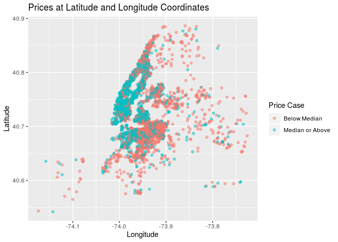
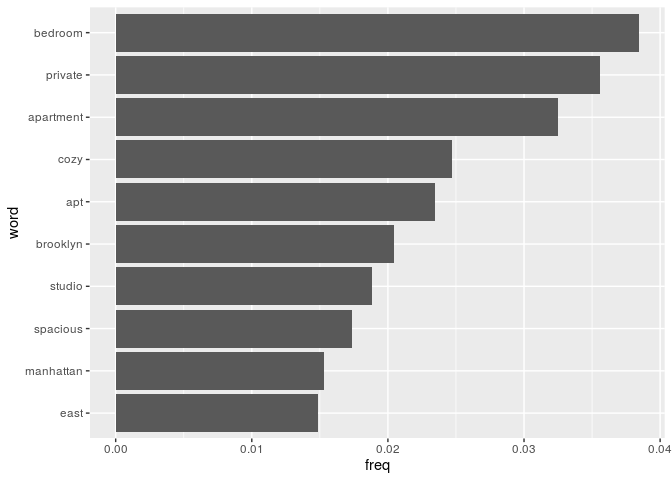

    
### Load packages & data 


```r
library(tidyverse) 
library(infer)
library(openintro)
library(dplyr)
library(knitr)
library(broom)
library(tidytext)
```

Uploaded the Airbnb data set from Kaggle via a csv file:


```r
abnb <- read_csv("AB_NYC_2019.csv")
```

Assuming that the data we have for Airbnbs in New York City represents the population. In order to perform the following analysis we used sample_n to randomly select 31 sample observations.

In part I, the following research question will be examined: How does location (borough and neighborhood, for example) influence the price of a listing?

In part II, the following research question will be examined: How does the way in which a property is listed (type of room, for example) influence the availability of a listing?

### Part A

Creating the sample that we will perform the following analysis on:


```r
set.seed(111519)
abnb_sample <- sample_n(abnb, 4000)
```

Constructing a bootstrap distribution for the median price of Airbnbs in NYC:


```r
set.seed(111519)
boot_dist_median_price <- abnb_sample %>%
  specify(response = price) %>%
  generate(reps = 1000, type = "bootstrap") %>%
  calculate(stat = "median")
```

Creating a 95% bootstrap confidence interval for the the median price of Airbnbs in NYC:


```r
(ci_bounds <- get_ci(boot_dist_median_price, level= 0.95))
```

```
## # A tibble: 1 x 2
##   `2.5%` `97.5%`
##    <dbl>   <dbl>
## 1    100     110
```

We are 95% confident that the population median price per night of Airbnbs in NYC is between $100.00 and $110.00.

Creating a visualizaing of the bootstrap distribution for median price:


```r
visualize(boot_dist_median_price) + 
  labs(title = "Bootstrap Dist of Median Price") +
  shade_ci(ci_bounds)
```

<!-- -->

### Part B

Using fct_relevel to make Manhattan the baseline level for neighbourhood_group:


```r
abnb_sample <- abnb_sample %>%
  mutate(neighbourhood_group = fct_relevel(neighbourhood_group, 
                                           "Manhattan", 
                                           "Brooklyn",
                                           "Staten Island",
                                           "Queens",
                                           "Bronx"))
```

Creating a linear model to predict Airbnb price by neighbourhood_group:


```r
lm_price_borough <- lm(price ~ neighbourhood_group, data = abnb_sample)

lm_price_borough %>% 
  tidy() %>% 
  select(term, estimate) %>%
  kable(format = "markdown", digits =3)
```


|term                             | estimate|
|:--------------------------------|--------:|
|(Intercept)                      |  206.848|
|neighbourhood_groupBrooklyn      |  -85.106|
|neighbourhood_groupStaten Island | -117.674|
|neighbourhood_groupQueens        | -110.432|
|neighbourhood_groupBronx         | -126.213|

The linear model is:

`price-hat = 206.848 -85.106*(neighbourhood_groupBrooklyn) -117.674*(neighbourhood_groupStaten Island) -110.432*(neighbourhood_groupQueens) -126.213(neighbourhood_groupBronx)`

Intepreting the intercept:

Given that the Airbnb is in Manhattan the expected price, on average, is $206.85. In this case, the intercept does have a meaningful interpretation because an Airbnb could be $206.85 per night.

Interpreting the slopes using lm_price_borough linear model:

For an Airbnb in Brooklyn, the average price is expected, on average, to be $85.11 less than an Airbnb in Manhattan, holding all else constant.

For an Airbnb in Staten Island, the average price is expected, on average, to be $117.67 less than an Airbnb in Manhattan, holding all else constant.

For an Airbnb in Queens, the average price is expected, on average, to be $110.43 less than an Airbnb in Manhattan, holding all else constant.

For an Airbnb in Bronx, the average price is expected, on average, to be $126.21 less than an Airbnb in Manhattan, holding all else constant.

We are now going to add R^2 to our linear model above.


```r
glance(lm_price_borough)$r.squared
```

```
## [1] 0.03669659
```

This means that roughly 3.670% of the variability in average price can be explained by the neighborhood type of Airbnbs in New York City.

### Part C

We are suspicious that there might be a relationship between median price in Manhattan and Brooklyn because they contain the largest amount and the most expensive Airbnbs. Therefore we will attempt to answer the following: Is there is a difference in the true median prices between Manhattan and Brooklyn?


```r
abnb_sample_filtered <- abnb_sample %>%
  filter(neighbourhood_group == "Manhattan" | neighbourhood_group == "Brooklyn")
```


```r
abnb_sample_filtered %>%
  group_by(neighbourhood_group) %>%
  summarise(med_price = median(price))
```

```
## # A tibble: 2 x 2
##   neighbourhood_group med_price
##   <fct>                   <dbl>
## 1 Manhattan                 150
## 2 Brooklyn                   90
```

The observed median prices for Manhattan and Brooklyn are $150.00 and $90.00, respectively. Therefore, the observed difference in median prices is $60.

Null Hypothesis: There is no difference in median price between Manhattan and Brooklyn Airbnb per night.

Alternative Hypothesis: There is a difference in median price between Manhattan and Brooklyn Airbnb per night.


```r
set.seed(111519)
null_dist_man_brook_med_price <- abnb_sample_filtered %>%
  specify(response = price, explanatory = neighbourhood_group) %>%
  hypothesize(null = "independence") %>%
  generate(reps = 1000, type = "permute") %>%
  calculate(stat = "diff in medians", order = c("Manhattan", "Brooklyn"))
```

Visualizing the null distribution.


```r
visualize(null_dist_man_brook_med_price) + 
  labs(title = "Null Dist of Difference in Median Price between Manhattan and Brooklyn") +
  shade_p_value(obs_stat = 60, direction = "two_sided")
```

```
## Warning: F usually corresponds to right-tailed tests. Proceed with caution.
```

<!-- -->

Findng the p-value.


```r
get_p_value(null_dist_man_brook_med_price, 60, direction = "two_sided")
```

```
## # A tibble: 1 x 1
##   p_value
##     <dbl>
## 1       0
```

The p-value is 0 which is less than the significance value of 0.05. Therefore, we reject the null hypothesis that there is no difference in median price between Manhattan and Brooklyn Airbnb per night. We can conclude that the data does provide convincing evidence of a difference in median price of Airbnbs for listings in Manhattan and Brooklyn.

### Part D


```r
abnb_sample <- abnb_sample %>%
   mutate(price_median = median(price), 
          price_case = case_when(
      price >= price_median ~ "Median or Above",
      price < price_median ~ "Below Median", 
    ))
```


```r
abnb_sample %>%
  ggplot(mapping = aes (x = longitude, y = latitude, color = price_case)) +
  geom_jitter(alpha = 0.5) +
  labs(title = "Prices at Latitude and Longitude Coordinates", x = "Longitude", y = "Latitude", color = "Price Case")
```

<!-- -->


```r
abnb_sample %>%
  count(neighbourhood_group, price_case) %>%
  group_by(neighbourhood_group) %>%
  mutate(rel_freq = n/sum(n)) %>%
  filter(price_case == "Median or Above")
```

```
## # A tibble: 5 x 4
## # Groups:   neighbourhood_group [5]
##   neighbourhood_group price_case          n rel_freq
##   <fct>               <chr>           <int>    <dbl>
## 1 Manhattan           Median or Above  1184    0.688
## 2 Brooklyn            Median or Above   680    0.404
## 3 Staten Island       Median or Above     5    0.217
## 4 Queens              Median or Above   119    0.245
## 5 Bronx               Median or Above    13    0.153
```

WANT TO SAY WHETHER PRICE IS DEPENDEDNT ON LOCATION OF BOROUGH!

### Part E


```r
abnb_sample %>%
  group_by(neighbourhood, neighbourhood_group) %>%
  summarise(med_price = median(price)) %>%
  arrange(desc(med_price)) %>%
  head(10)
```

```
## # A tibble: 10 x 3
## # Groups:   neighbourhood [10]
##    neighbourhood     neighbourhood_group med_price
##    <chr>             <fct>                   <dbl>
##  1 Eastchester       Bronx                    475 
##  2 Far Rockaway      Queens                   450 
##  3 Tribeca           Manhattan                450 
##  4 Vinegar Hill      Brooklyn                 354.
##  5 NoHo              Manhattan                325 
##  6 Castleton Corners Staten Island            299 
##  7 Rockaway Beach    Queens                   297 
##  8 DUMBO             Brooklyn                 250 
##  9 Highbridge        Bronx                    240 
## 10 Great Kills       Staten Island            235
```


### Part II

Second research question: How does the way in which a property is listed (type of room, for example) influence the availability of a listing?


```r
abnb_sample <- abnb_sample %>%
  mutate(availability_365_case = case_when(
      availability_365 <= 73  ~ "Low",
      availability_365 <= 143 & availability_365 > 73 ~ "Medium Low",
      availability_365 > 143 & availability_365 <= 219 ~ "Medium",
      availability_365 > 219 & availability_365 <= 292 ~ "Medium High",
      availability_365 > 292 ~ "High", 
    ))
```


```r
abnb_text <- abnb_sample %>%
  select(id, name, availability_365_case, availability_365)
```


```r
remove_reg <- "&amp;|&lt;|&gt;"
tidy_description <- abnb_text %>%
  mutate(name = str_remove_all(name, remove_reg)) %>%
  unnest_tokens(word, name)

tidy_description
```

```
## # A tibble: 24,435 x 4
##          id availability_365_case availability_365 word     
##       <dbl> <chr>                            <dbl> <chr>    
##  1 26274952 Low                                 72 entire   
##  2 26274952 Low                                 72 apartment
##  3 26274952 Low                                 72 in       
##  4 26274952 Low                                 72 house    
##  5 26274952 Low                                 72 20mins   
##  6 26274952 Low                                 72 to       
##  7 26274952 Low                                 72 free     
##  8 26274952 Low                                 72 ferry    
##  9 35771605 Low                                 25 master   
## 10 35771605 Low                                 25 bedroom  
## # … with 24,425 more rows
```


```r
tidy_description <- tidy_description %>%
  filter(!word %in% stop_words $ word,
         !word %in% str_remove_all(stop_words$word, "'"),
         str_detect(word, "[a-z]"))

tidy_description %>%
  count(word, availability_365, sort = T) %>%
  arrange(availability_365) %>%
  head(10)
```

```
## # A tibble: 10 x 3
##    word         availability_365     n
##    <chr>                   <dbl> <int>
##  1 bedroom                     0   275
##  2 apartment                   0   236
##  3 private                     0   208
##  4 cozy                        0   171
##  5 apt                         0   170
##  6 brooklyn                    0   146
##  7 spacious                    0   135
##  8 studio                      0   130
##  9 east                        0   114
## 10 williamsburg                0   106
```


```r
frequency_all <- tidy_description %>%
  count(word, sort = T) %>%
  mutate(freq = n / sum(n)) 
```


```r
ggplot(frequency_all %>% top_n(10, freq) %>%
         mutate(word = reorder(word, freq)), aes(x = word, y = freq))+
  geom_col()+ 
  coord_flip()
```

<!-- -->


```r
tidy_description %>%
  group_by(availability_365_case) %>%
  count(word, sort = T) %>% 
  filter(availability_365_case == "Low") %>%
  arrange(desc(n)) %>%
  head(10)
```

```
## # A tibble: 10 x 3
## # Groups:   availability_365_case [1]
##    availability_365_case word          n
##    <chr>                 <chr>     <int>
##  1 Low                   bedroom     399
##  2 Low                   apartment   356
##  3 Low                   private     331
##  4 Low                   cozy        252
##  5 Low                   apt         239
##  6 Low                   brooklyn    213
##  7 Low                   spacious    199
##  8 Low                   studio      197
##  9 Low                   east        165
## 10 Low                   sunny       147
```


Creating a linear model to predict Airbnb availability by roomtype wth entire home/apt as be our baseline.


```r
lm_avail_room_type <- lm(availability_365 ~ room_type, data = abnb_sample)

lm_avail_room_type %>% 
  tidy() %>% 
  select(term, estimate) %>%
  kable(format = "markdown", digits =3)
```


|term                  | estimate|
|:---------------------|--------:|
|(Intercept)           |  115.774|
|room_typePrivate room |   -3.443|
|room_typeShared room  |   74.912|

The linear model is:

`price-hat = 115.774 -3.443*(room_typePrivateroom) +74.912*(room_typeShared room)`

Intepreting the intercept:

Given that the Airbnb has the roomtype of entire house/apt the expected availability, on average, is 115.8 days out of the year. In this case, the intercept does have a meaningful interpretation because an Airbnb could be available for 121 days out of 365 per year.

Interpreting the slopes using lm_avail_room_type linear model:

For an Airbnb with roomtype of private room, the average availability is expected, on average, to be 3.4 days less per year than an Airbnb in wth room type of entire house/apt, holding all else constant.

For an Airbnb with roomtype of shared room, the average availability is expected, on average, to be 74.9 days more per year than an Airbnb in wth room type of entire house/apt, holding all else constant.


We are now going to add R^2 to our linear model above.


```r
glance(lm_avail_room_type)$r.squared
```

```
## [1] 0.008414499
```

This means that roughly 0.841% of the variability in average availiability can be explained by the type of room of Airbnb in New York.


Constructing a bootstrap distribution for the median number of available days of Airbnbs in NYC:


```r
set.seed(111519)
boot_dist_avail <- abnb_sample %>%
  specify(response = availability_365) %>%
  generate(reps = 1000, type = "bootstrap") %>%
  calculate(stat = "median")
```

Creating a 95% bootstrap confidence interval for the median number of available days of an Airbnb in NYC:


```r
(ci_bounds <- get_ci(boot_dist_avail, level= 0.95))
```

```
## # A tibble: 1 x 2
##   `2.5%` `97.5%`
##    <dbl>   <dbl>
## 1     42      57
```

We are 95% confident that the median number of available days of Airbnbs in New York City is between 42 and 57 days.

Creating a visualization of the bootstrap distribution for median price:


```r
visualize(boot_dist_avail) + 
  labs(title = "Bootstrap Dist of Median Number of Available Days of Airbnbs in NYC") +
  shade_ci(ci_bounds)
```

<!-- -->


Removing NA values and creating a full model for availability_365:


```r
abnb_model <- abnb_sample %>%
  drop_na(availability_365,
          room_type, minimum_nights, 
          number_of_reviews,
          calculated_host_listings_count, 
          price_case, 
          reviews_per_month)

m_full_model <- lm(availability_365 ~ room_type + 
                     minimum_nights +  
                     number_of_reviews + 
                     calculated_host_listings_count + 
                     price_case + 
                     reviews_per_month, data = abnb_model)
```

Performing model selection using AIC for Availability:


```r
selected_model <- step(m_full_model, direction = "backward")

tidy(selected_model) %>%
  select(term, estimate) %>%
  kable(format = "markdown", digits = 3)
```

The linear model for this model is:

`availability_365 = 59.923 + 26.396*(room_typePrivate room) + 115.98*(room_typeShared room) + 0.481*(minimum_nights) + 0.461*(number_of_reviews) + 0.853*(calculated_host_listings_count) + 29.622*(price_caseMedian or Above) + 5.93*(reviews_per_month)`

Determining R-squared:


```r
glance(selected_model)$r.squared
```

```
## [1] 0.1048801
```

The R-squared value is 10.49% of the variability in availibility can be explained by this model. 

***
TO DO:
1. Add R squared for models we have
2. Bootstrap Distribution, Visualization, CI for Availability
3. Evertything (Room Type, Min Night, Number of Reviews, Calculated Host Listing, price_case, Reviews per month) AIC Model Selection for Availability — R squared and AIC Values
4. Host high volume or low volume
***
