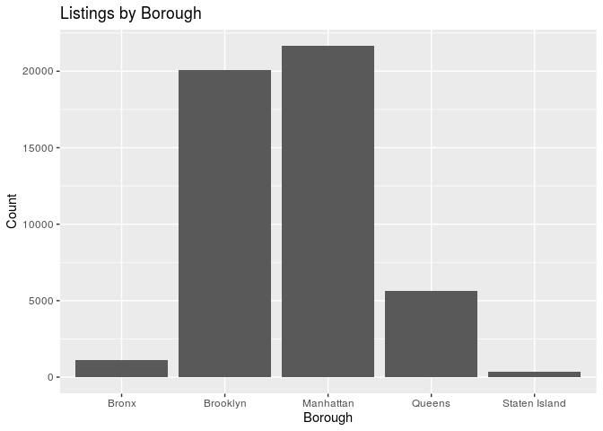
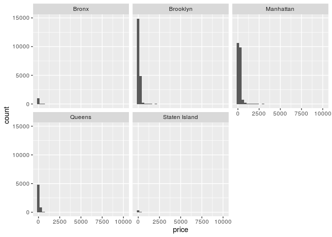
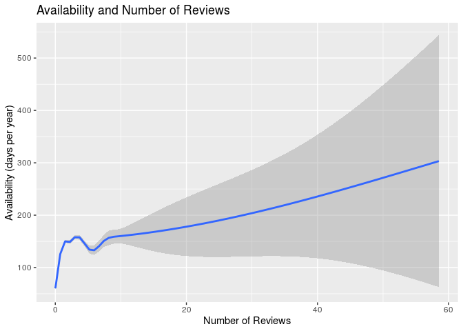
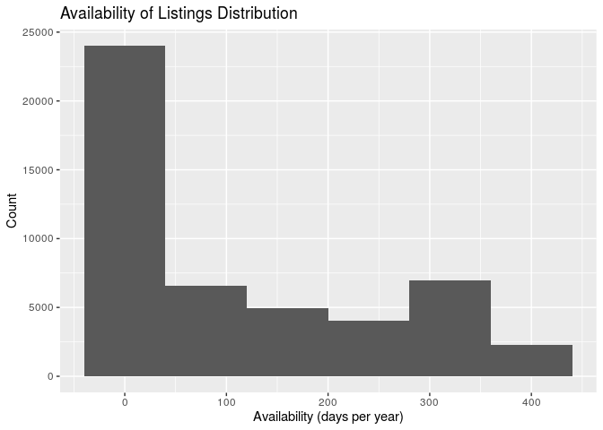

NYC Airbnnb Popularity Factors
================
Team World
10/24/2019

### Section 1. Introduction

Using the Airbnb dataset, we hope to gain a better understanding of the
gig hospitality market in New York City for 2019. Specifically, we want
to find, explore and understand trends in the market as they relate to
supply (availability) and demand (what people are willing to pay). The
data set we chose allows us to draw conclusions and understand the
factors that contribute to the New York City Airbnb scene.

Through Kaggle, we found this data set
(<https://www.kaggle.com/dgomonov/new-york-city-airbnb-open-data>) that
was collected, and continues to be updated, in 2019 on Airbnb listings
in New York City. This data set continues to be curated by a 4th year
data science student at Drexel University (Dgomonov). We are unable to
reach out to him to get more information on the data set, such as where
he got it from or how he collected it, because our account on Kaggle is
not at the “Contributor tier.”

To analyze this data set it is first important to understand its
variables which include: listing ID, name of the listing, host ID, name
of the host, location, neighbourhood, latitude and longitude
coordinates, room type, price in dollars, minimum\_nights, number of
reviews, latest review, number of reviews per month, amount of listing
per host and availability. A description of each of these is included in
the codebook.

Based on these factors, it seems as though price and availibility would
make the most interesting response variables because they are very
important to understand the economic landscape. For example someone who
is looking to book an Airbnb is going to be very interested in what is
availible within their budget. Of course there are going to be other
factors that are important to a consumer, such as location within NYC.
However, we expect availability and price to be the most predictive and
representative of the Airbnbs in New York City.

how variables such as price, location, description, reviews, and
availability. We wanted to look at the gig hospitality market in NYC. We
plan to compare price by neighborhood and borough which could provide
interesting insights into the cost of living in NYC.

### Section 2. Exploratory data analysis

### Load packages & data

Loaded the tidyverse and broom packages:

``` r
library(tidyverse) 
library(broom)
```

Uploaded the Airbnb data set from Kaggle via a csv file:

``` r
abnb <- read_csv("AB_NYC_2019.csv")
```

LOCATION AND PRICE:

Univariate Borough Count (Visualization):

``` r
ggplot(data = abnb, mapping = aes(x = neighbourhood_group)) +
  geom_histogram(stat = "count") + 
  labs(title = "Listings by Borough", x = "Borough", y = "Count")
```

    ## Warning: Ignoring unknown parameters: binwidth, bins, pad

<!-- -->

Univariate Borough Count (Summary)

``` r
abnb %>%
  count(neighbourhood_group) %>%
  arrange(desc(n))
```

    ## # A tibble: 5 x 2
    ##   neighbourhood_group     n
    ##   <chr>               <int>
    ## 1 Manhattan           21661
    ## 2 Brooklyn            20104
    ## 3 Queens               5666
    ## 4 Bronx                1091
    ## 5 Staten Island         373

``` r
abnb %>%
  ggplot(mapping = aes(x = neighbourhood_group, y = price)) +
  geom_boxplot() + 
  labs(title = "Price of Listings by Borough", x = "Borough", y = "Price")
```

<!-- -->

``` r
abnb %>%
  group_by(neighbourhood_group) %>%
  summarise(
    med_price = median(price), 
    IQR_price = IQR(price)
    ) %>%
  arrange(desc(med_price)) %>%
  head(5)
```

    ## # A tibble: 5 x 3
    ##   neighbourhood_group med_price IQR_price
    ##   <chr>                   <dbl>     <dbl>
    ## 1 Manhattan                 150       125
    ## 2 Brooklyn                   90        90
    ## 3 Queens                     75        60
    ## 4 Staten Island              75        60
    ## 5 Bronx                      65        54

``` r
abnb %>%
  group_by(neighbourhood_group, neighbourhood) %>%
  summarise(median_price = median(price)) %>%
  arrange(desc(median_price)) %>%
  head(5)
```

    ## # A tibble: 5 x 3
    ## # Groups:   neighbourhood_group [3]
    ##   neighbourhood_group neighbourhood  median_price
    ##   <chr>               <chr>                 <dbl>
    ## 1 Staten Island       Fort Wadsworth          800
    ## 2 Staten Island       Woodrow                 700
    ## 3 Manhattan           Tribeca                 295
    ## 4 Queens              Neponsit                274
    ## 5 Manhattan           NoHo                    250

LISTING DETAILS AND AVAILABILITY

``` r
abnb %>%
  ggplot(mapping = aes(x = availability_365)) +
  geom_histogram(binwidth=80) + 
  labs(title = "Availability of Listings Distribution",
       x = "Availability (days per year)",
       y = "Count"
  )
```

<!-- -->

``` r
abnb %>%
  ggplot(mapping = aes(x =  reviews_per_month, y = availability_365, color = room_type)) +
  geom_point(alpha=0.2) + 
  labs(
    title = "Availability and Number of Reviews",
    x = "Number of Reviews", 
    y = "Availability (days per year)")
```

    ## Warning: Removed 10052 rows containing missing values (geom_point).

<!-- -->

``` r
abnb %>%
  mutate(avail = ifelse(availability_365 > median(availability_365), "more", "less")) %>%
  filter(avail == "more") %>%
  ggplot(mapping = aes(x =  number_of_reviews, y = availability_365, color = room_type)) +
  geom_point() + 
  labs(
    title = "Availability and Number of Reviews by Room Type",
    subtitle = "Below Median Availability",
    x = "Number of Reviews", 
    y = "Availability (days per year)")
```

<!-- -->

### Section 3. Research questions

How does location (borough and neighborhood, for example) influence the
price of a listing?

How does the way in which a property is listed (type of room, for
example) influence the availability of a listing?

### Section 4. Data

Used the glimpse function to show information about and part of abnb:

``` r
glimpse(abnb)
```

    ## Observations: 48,895
    ## Variables: 16
    ## $ id                             <dbl> 2539, 2595, 3647, 3831, 5022, 509…
    ## $ name                           <chr> "Clean & quiet apt home by the pa…
    ## $ host_id                        <dbl> 2787, 2845, 4632, 4869, 7192, 732…
    ## $ host_name                      <chr> "John", "Jennifer", "Elisabeth", …
    ## $ neighbourhood_group            <chr> "Brooklyn", "Manhattan", "Manhatt…
    ## $ neighbourhood                  <chr> "Kensington", "Midtown", "Harlem"…
    ## $ latitude                       <dbl> 40.64749, 40.75362, 40.80902, 40.…
    ## $ longitude                      <dbl> -73.97237, -73.98377, -73.94190, …
    ## $ room_type                      <chr> "Private room", "Entire home/apt"…
    ## $ price                          <dbl> 149, 225, 150, 89, 80, 200, 60, 7…
    ## $ minimum_nights                 <dbl> 1, 1, 3, 1, 10, 3, 45, 2, 2, 1, 5…
    ## $ number_of_reviews              <dbl> 9, 45, 0, 270, 9, 74, 49, 430, 11…
    ## $ last_review                    <date> 2018-10-19, 2019-05-21, NA, 2019…
    ## $ reviews_per_month              <dbl> 0.21, 0.38, NA, 4.64, 0.10, 0.59,…
    ## $ calculated_host_listings_count <dbl> 6, 2, 1, 1, 1, 1, 1, 1, 1, 4, 1, …
    ## $ availability_365               <dbl> 365, 355, 365, 194, 0, 129, 0, 22…
