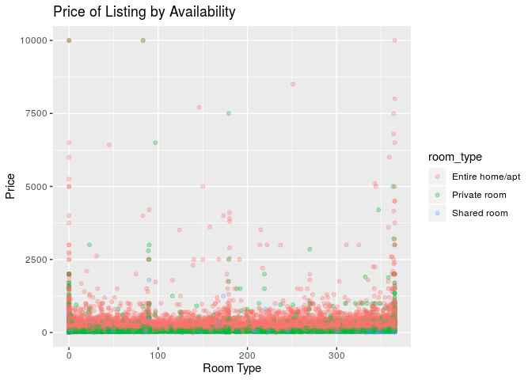

NYC Airbnnb Popularity Factors
================
Team World
10/24/2019

### Section 1. Introduction

Our topic is based on an AirBnb dataset in New York City for 2019.
Ultimately, we hope to determine the best AirBnb’s to rent based on
variables such as price, size, reviews and availability. We wanted to
look at Airbnb data because we thought this could be interesting insight
into the economic housing market in NYC. We plan to compare price by
neighborhood and borough which could provide interesting insights into
the cost of living in NYC. Through Kaggle we found this data set
(<https://www.kaggle.com/dgomonov/new-york-city-airbnb-open-data>) that
was collected in 2019 on Airbnb listings in New York City by a 4th year
data science student at Drexel University. The data set includes
variables: listing ID, name of the listing, host ID, name of the host,
location, neighbourhood, latitude and longitude coordinates, room type,
price in dollars, minimum\_nights, number of reviews, latest review,
number of reviews per month, amount of listing per host and
availability.

### Section 2. Exploratory data analysis

### Load packages & data

``` r
library(tidyverse) 
library(broom)
```

``` r
abnb <- read_csv("AB_NYC_2019.csv")
```

``` r
abnb %>%
  select(neighbourhood_group) %>%
  count(neighbourhood_group) %>%
  arrange(desc(n))
```

    ## # A tibble: 5 x 2
    ##   neighbourhood_group     n
    ##   <chr>               <int>
    ## 1 Manhattan           21661
    ## 2 Brooklyn            20104
    ## 3 Queens               5666
    ## 4 Bronx                1091
    ## 5 Staten Island         373

``` r
ggplot(data = abnb, mapping = aes(x = neighbourhood_group)) +
  geom_histogram(stat = "count") + 
  labs(title = "Listings by Borough", x = "Borough", y = "Count")
```

    ## Warning: Ignoring unknown parameters: binwidth, bins, pad

<!-- -->

``` r
abnb %>%
  group_by(neighbourhood_group) %>%
  select(neighbourhood) %>%
  count(neighbourhood) %>%
  arrange(desc(n))
```

    ## Adding missing grouping variables: `neighbourhood_group`

    ## # A tibble: 221 x 3
    ## # Groups:   neighbourhood_group [5]
    ##    neighbourhood_group neighbourhood          n
    ##    <chr>               <chr>              <int>
    ##  1 Brooklyn            Williamsburg        3920
    ##  2 Brooklyn            Bedford-Stuyvesant  3714
    ##  3 Manhattan           Harlem              2658
    ##  4 Brooklyn            Bushwick            2465
    ##  5 Manhattan           Upper West Side     1971
    ##  6 Manhattan           Hell's Kitchen      1958
    ##  7 Manhattan           East Village        1853
    ##  8 Manhattan           Upper East Side     1798
    ##  9 Brooklyn            Crown Heights       1564
    ## 10 Manhattan           Midtown             1545
    ## # … with 211 more rows

``` r
abnb %>%
  ggplot(mapping = aes(x = neighbourhood_group, y = price)) +
  geom_boxplot() + 
  labs(title = "Price of Listings by Borough", x = "Borough", y = "Price")
```

<!-- -->

``` r
abnb %>%
  ggplot(mapping = aes(x = availability_365, y = price, color = room_type)) +
  geom_point(alpha = 0.3) + 
  labs(title = "Price of Listing by Availability", x = "Room Type", y = "Price")
```

<!-- -->

### Section 3. Research questions

### Section 4. Data
