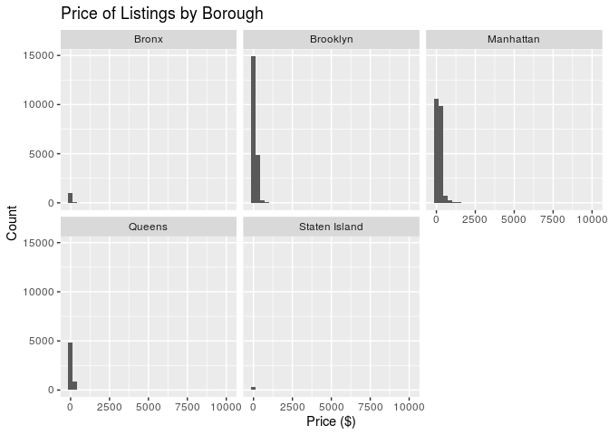

NYC Airbnnb Popularity Factors
================
Team World
10/24/2019

### Section 1. Introduction

Our topic is based on an Airbnb dataset in New York City for 2019.
Ultimately, we hope to determine the best Airbnbs to rent based on
variables such as price, size, reviews and availability. We wanted to
look at Airbnb data because we thought this could be interesting insight
into the economic housing market in NYC. We plan to compare price by
neighborhood and borough which could provide interesting insights into
the cost of living in NYC. Through Kaggle we found this data set
(<https://www.kaggle.com/dgomonov/new-york-city-airbnb-open-data>) that
was collected in 2019 on Airbnb listings in New York City by a 4th year
data science student at Drexel University. The data set includes
variables: listing ID, name of the listing, host ID, name of the host,
location, neighbourhood, latitude and longitude coordinates, room type,
price in dollars, minimum\_nights, number of reviews, latest review,
number of reviews per month, amount of listing per host and
availability.

### Section 2. Exploratory data analysis

### Load packages & data

``` r
library(tidyverse) 
library(broom)
```

``` r
abnb <- read_csv("AB_NYC_2019.csv")
```

``` r
abnb %>%
  select(neighbourhood_group) %>%
  count(neighbourhood_group) %>%
  arrange(desc(n))
```

    ## # A tibble: 5 x 2
    ##   neighbourhood_group     n
    ##   <chr>               <int>
    ## 1 Manhattan           21661
    ## 2 Brooklyn            20104
    ## 3 Queens               5666
    ## 4 Bronx                1091
    ## 5 Staten Island         373

``` r
ggplot(data = abnb, mapping = aes(x = neighbourhood_group)) +
  geom_histogram(stat = "count") + 
  labs(title = "Listings by Borough", x = "Borough", y = "Count")
```

    ## Warning: Ignoring unknown parameters: binwidth, bins, pad

<!-- -->

``` r
abnb %>%
  group_by(neighbourhood_group) %>%
  select(neighbourhood) %>%
  count(neighbourhood) %>%
  arrange(desc(n)) %>%
  head(10)
```

    ## Adding missing grouping variables: `neighbourhood_group`

    ## # A tibble: 10 x 3
    ## # Groups:   neighbourhood_group [2]
    ##    neighbourhood_group neighbourhood          n
    ##    <chr>               <chr>              <int>
    ##  1 Brooklyn            Williamsburg        3920
    ##  2 Brooklyn            Bedford-Stuyvesant  3714
    ##  3 Manhattan           Harlem              2658
    ##  4 Brooklyn            Bushwick            2465
    ##  5 Manhattan           Upper West Side     1971
    ##  6 Manhattan           Hell's Kitchen      1958
    ##  7 Manhattan           East Village        1853
    ##  8 Manhattan           Upper East Side     1798
    ##  9 Brooklyn            Crown Heights       1564
    ## 10 Manhattan           Midtown             1545

``` r
abnb %>%
  ggplot(mapping = aes(x = neighbourhood_group, y = price)) +
  geom_boxplot() + 
  labs(title = "Price of Listings by Borough", x = "Borough", y = "Price")
```

<!-- -->

``` r
abnb %>%
  group_by(neighbourhood_group) %>%
  summarise(
    med_price = mean(price), 
    IQR_price = IQR(price)
    )
```

    ## # A tibble: 5 x 3
    ##   neighbourhood_group med_price IQR_price
    ##   <chr>                   <dbl>     <dbl>
    ## 1 Bronx                    87.5        54
    ## 2 Brooklyn                124.         90
    ## 3 Manhattan               197.        125
    ## 4 Queens                   99.5        60
    ## 5 Staten Island           115.         60

``` r
abnb %>%
  summarise(
    med_price = mean(price), 
    IQR_price = IQR(price)
    )
```

    ## # A tibble: 1 x 2
    ##   med_price IQR_price
    ##       <dbl>     <dbl>
    ## 1      153.       106

``` r
abnb %>%
  mutate(price_tier = ifelse(price > median(price), "upper", "lower")) %>%
  filter(price_tier == "upper") %>%
  ggplot(mapping = aes(x = availability_365, y = price)) +
  geom_point(alpha = 0.2) + 
  facet_grid(.~room_type) +
  labs(
    title = "Price of Listing and Availability by Room Type",
    subtitle = "Above Median Listing Price",
    x = "Availability", 
    y = "Price")
```

<!-- -->

``` r
abnb %>%
  mutate(price_tier = ifelse(price > median(price), "upper", "lower")) %>%
  filter(price_tier == "lower") %>%
  ggplot(mapping = aes(x = availability_365, y = price)) +
  geom_point(alpha = 0.2) + 
  facet_grid(.~room_type) +
  labs(
    title = "Price of Listing and Availability by Room Type",
    subtitle = "Below Median Listing Price",
    x = "Availability", 
    y = "Price")
```

<!-- -->

### Section 3. Research questions

How does location (for example, borough, neighborhood, and coordinates)
influence the price of a listing?

How does the listing type (type of room) and online traffic (for
example, review, when last reviewed) room incluence the availability of
a listing?

Show one things up there\!\!\!

### Section 4. Data

``` r
glimpse(abnb)
```

    ## Observations: 48,895
    ## Variables: 16
    ## $ id                             <dbl> 2539, 2595, 3647, 3831, 5022, 509…
    ## $ name                           <chr> "Clean & quiet apt home by the pa…
    ## $ host_id                        <dbl> 2787, 2845, 4632, 4869, 7192, 732…
    ## $ host_name                      <chr> "John", "Jennifer", "Elisabeth", …
    ## $ neighbourhood_group            <chr> "Brooklyn", "Manhattan", "Manhatt…
    ## $ neighbourhood                  <chr> "Kensington", "Midtown", "Harlem"…
    ## $ latitude                       <dbl> 40.64749, 40.75362, 40.80902, 40.…
    ## $ longitude                      <dbl> -73.97237, -73.98377, -73.94190, …
    ## $ room_type                      <chr> "Private room", "Entire home/apt"…
    ## $ price                          <dbl> 149, 225, 150, 89, 80, 200, 60, 7…
    ## $ minimum_nights                 <dbl> 1, 1, 3, 1, 10, 3, 45, 2, 2, 1, 5…
    ## $ number_of_reviews              <dbl> 9, 45, 0, 270, 9, 74, 49, 430, 11…
    ## $ last_review                    <date> 2018-10-19, 2019-05-21, NA, 2019…
    ## $ reviews_per_month              <dbl> 0.21, 0.38, NA, 4.64, 0.10, 0.59,…
    ## $ calculated_host_listings_count <dbl> 6, 2, 1, 1, 1, 1, 1, 1, 1, 4, 1, …
    ## $ availability_365               <dbl> 365, 355, 365, 194, 0, 129, 0, 22…
