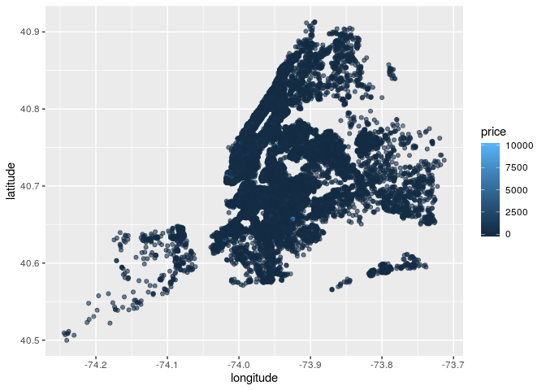

NYC Airbnnb Popularity Factors
================
Team World
10/24/2019

### Section 1. Introduction

Our topic is based on an Airbnb dataset in New York City for 2019.
Ultimately, we hope to determine the best Airbnbs to rent based on
variables such as price, location, description, reviews, and
availability. We wanted to look at the gig hospitality market in NYC. We
plan to compare price by neighborhood and borough which could provide
interesting insights into the cost of living in NYC.

Through Kaggle, we found this data set
(<https://www.kaggle.com/dgomonov/new-york-city-airbnb-open-data>) that
was collected, and continues to be updated, in 2019 on Airbnb listings
in New York City by a 4th year data science student at Drexel
University. The data set includes variables: listing ID, name of the
listing, host ID, name of the host, location, neighbourhood, latitude
and longitude coordinates, room type, price in dollars, minimum\_nights,
number of reviews, latest review, number of reviews per month, amount of
listing per host and availability. A description of each of these is
included in the codebook.

### Section 2. Exploratory data analysis

### Load packages & data

Loaded the tidyverse and broom packages:

``` r
library(tidyverse) 
library(broom)
```

Uploaded the Airbnb data set from Kaggle via a csv file:

``` r
abnb <- read_csv("AB_NYC_2019.csv")
```

Univariate Borough Count (Visualization):

``` r
ggplot(data = abnb, mapping = aes(x = neighbourhood_group)) +
  geom_histogram(stat = "count") + 
  labs(title = "Listings by Borough", x = "Borough", y = "Count")
```

    ## Warning: Ignoring unknown parameters: binwidth, bins, pad

<!-- -->

Univariate Borough Count (Summary)

``` r
abnb %>%
  count(neighbourhood_group) %>%
  arrange(desc(n))
```

    ## # A tibble: 5 x 2
    ##   neighbourhood_group     n
    ##   <chr>               <int>
    ## 1 Manhattan           21661
    ## 2 Brooklyn            20104
    ## 3 Queens               5666
    ## 4 Bronx                1091
    ## 5 Staten Island         373

``` r
abnb %>%
  ggplot(mapping = aes(x = availability_365)) +
  geom_histogram() + 
  labs(title = "Availability of Listings Distribution",
       x = "Availability (days per year)",
       y = "Count"
  )
```

    ## `stat_bin()` using `bins = 30`. Pick better value with `binwidth`.

<!-- -->

``` r
abnb %>%
  ggplot(mapping = aes(x =  reviews_per_month, y = availability_365)) +
  geom_smooth() + 
  labs(
    title = "Availability and Number of Reviews",
    x = "Number of Reviews", 
    y = "Availability (days per year)")
```

    ## Warning: Removed 10052 rows containing non-finite values (stat_smooth).

<!-- -->

``` r
abnb %>%
  mutate(avail = ifelse(number_of_reviews > median(number_of_reviews), "more", "less")) %>%
  filter(avail == "more") %>%
  ggplot(mapping = aes(x =  number_of_reviews, y = availability_365)) +
  geom_smooth() + 
  labs(
    title = "Availability and Number of Reviews by Room Type",
    subtitle = "Below Median Availability",
    x = "Number of Reviews", 
    y = "Availability (days per year)")
```

    ## `geom_smooth()` using method = 'gam' and formula 'y ~ s(x, bs = "cs")'

<!-- -->

``` r
abnb %>%
  ggplot(mapping = aes(x = neighbourhood_group, y = price)) +
  geom_boxplot() + 
  labs(title = "Price of Listings by Borough", x = "Borough", y = "Price")
```

<!-- -->

``` r
abnb %>%
  group_by(neighbourhood_group) %>%
  summarise(
    med_price = median(price), 
    IQR_price = IQR(price)
    ) %>%
  arrange(desc(med_price)) %>%
  head(10)
```

    ## # A tibble: 5 x 3
    ##   neighbourhood_group med_price IQR_price
    ##   <chr>                   <dbl>     <dbl>
    ## 1 Manhattan                 150       125
    ## 2 Brooklyn                   90        90
    ## 3 Queens                     75        60
    ## 4 Staten Island              75        60
    ## 5 Bronx                      65        54

``` r
abnb %>%
  group_by(neighbourhood_group, neighbourhood) %>%
  summarise(median_price = median(price)) %>%
  arrange(desc(median_price)) %>%
  head(5)
```

    ## # A tibble: 5 x 3
    ## # Groups:   neighbourhood_group [3]
    ##   neighbourhood_group neighbourhood  median_price
    ##   <chr>               <chr>                 <dbl>
    ## 1 Staten Island       Fort Wadsworth          800
    ## 2 Staten Island       Woodrow                 700
    ## 3 Manhattan           Tribeca                 295
    ## 4 Queens              Neponsit                274
    ## 5 Manhattan           NoHo                    250

### Section 3. Research questions

How does location (borough and neighborhood, for example) influence the
price of a listing?

How does the way in which a property is listed (type of room, for
example) influence the availability of a listing?

### Section 4. Data

Used the glimpse function to show information about and part of abnb:

``` r
glimpse(abnb)
```

    ## Observations: 48,895
    ## Variables: 16
    ## $ id                             <dbl> 2539, 2595, 3647, 3831, 5022, 509…
    ## $ name                           <chr> "Clean & quiet apt home by the pa…
    ## $ host_id                        <dbl> 2787, 2845, 4632, 4869, 7192, 732…
    ## $ host_name                      <chr> "John", "Jennifer", "Elisabeth", …
    ## $ neighbourhood_group            <chr> "Brooklyn", "Manhattan", "Manhatt…
    ## $ neighbourhood                  <chr> "Kensington", "Midtown", "Harlem"…
    ## $ latitude                       <dbl> 40.64749, 40.75362, 40.80902, 40.…
    ## $ longitude                      <dbl> -73.97237, -73.98377, -73.94190, …
    ## $ room_type                      <chr> "Private room", "Entire home/apt"…
    ## $ price                          <dbl> 149, 225, 150, 89, 80, 200, 60, 7…
    ## $ minimum_nights                 <dbl> 1, 1, 3, 1, 10, 3, 45, 2, 2, 1, 5…
    ## $ number_of_reviews              <dbl> 9, 45, 0, 270, 9, 74, 49, 430, 11…
    ## $ last_review                    <date> 2018-10-19, 2019-05-21, NA, 2019…
    ## $ reviews_per_month              <dbl> 0.21, 0.38, NA, 4.64, 0.10, 0.59,…
    ## $ calculated_host_listings_count <dbl> 6, 2, 1, 1, 1, 1, 1, 1, 1, 4, 1, …
    ## $ availability_365               <dbl> 365, 355, 365, 194, 0, 129, 0, 22…
