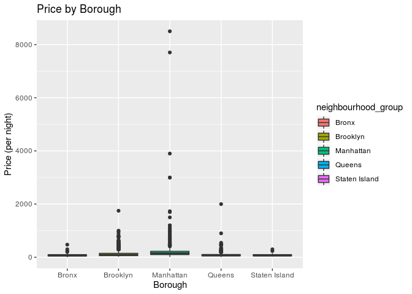
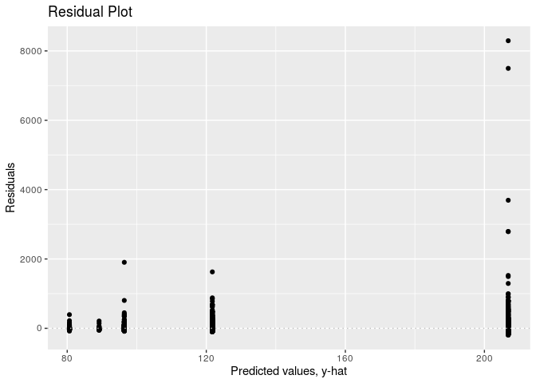
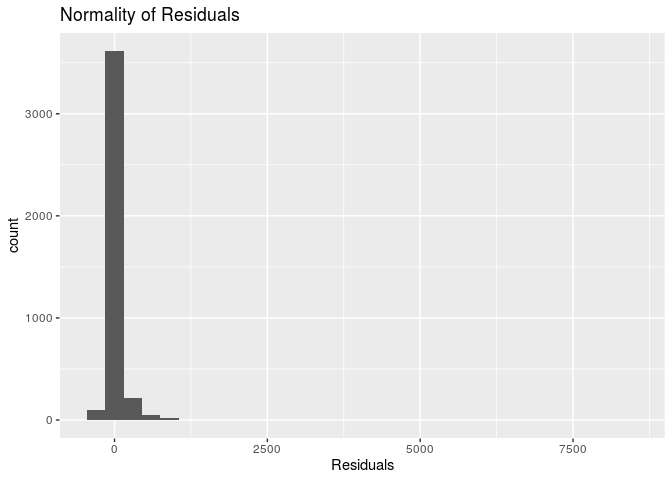

NYC Airbnb Popularity Factors
================
WORLD
12/6/2019

### Introduction:

Every day, thousands of tourists visit the historic city of New York. It
is one of the most populous city in the United States and is a popular
attraction for tourists, not only from the United States but around the
world. Given the popularity of tourists, the lodging and hotel industry
has benefited tremendously. Airbnb is an online marketplace for
arranging and offering homestays to thousands of tourists every day in
the beloved city of New York.

Through Kaggle, we found this data set
(<https://www.kaggle.com/dgomonov/new-york-city-airbnb-open-data>) that
was collected and continues to be updated through 2019 on Airbnb’s in
New York City. This data set continues to be curated by a 4th year data
science student at Drexel University (Dgomonov). We are unable to reach
out to him to get more information on the data set, such as where he got
it from or how he collected it, because our account on Kaggle is not at
the “Contributor tier.” However, we can reasonably infer that the
dataset was created by web scraping Airbnb’s website. Moreover, since
the dataset is looking at all the listings in NYC, we are assuming that
the dataset is indicative of a population. Therefore, we have created a
sample dataset for our data analysis.

To analyze this data set, it is first important to understand its
variables: listing ID, name of the listing, host ID, the name of the
host, location, neighbourhood, latitude, longitude, room type, price in
dollars, minimum nights, number of reviews, date of latest review,
number of reviews per month, amount of listings per host, and
availability.

Based on these factors, it seems as though price and availability would
make the most interesting response variables because they are very
important to understand the economic landscape. For example, someone who
is looking to book an Airbnb is going to be very interested in what is
available within their budget. Of course, there are going to be other
factors that are important to a consumer, such as location within NYC.
However, we expect availability and price to be the most predictive and
representative of the Airbnbs in New York City.

Our central focus will be on predicting, analyzing, and performing tests
on the price and availability of Airbnb listings. For our final project,
we want to answer two major research questions: How does location
influence the price of Airbnb listings and how does the way in which an
Airbnb is described influence availibility in New York City?

Using the Airbnb dataset, we hope to gain a better understanding of the
gig hospitality market in New York City for 2019. Specifically, we want
to find, explore and understand trends in the market as they relate to
supply (availability) and demand (what people are willing to pay). The
data set we chose allows us to draw conclusions and understand the
factors that contribute to the New York City Airbnb scene.

The dimensions and codebook are below:

### Dimensions:

`Observations: 48,895`

`Variables: 16`

### Codebook:

`Variable Name --> Description`

`id --> The specific listing's ID value from the Airbnb website.`

`name --> Host-produced description of the listing.`

`host_id --> The ID unique for the listing's owner.`

`host_name --> First name of host/hosts.`

`neighbourhood_group --> One of the NYC five boroughs (Manhattan,
Brooklyn, Queens, Staten Island, The Bronx)`

`neighbourhood --> Specific area within each of the boroughs.`

`latitude --> Horizontal global coordinate.`

`longitude --> Vertical global coordinate.`

`room_type --> One of three classifications (Etire home/apartment,
Private Room, or Shared Room).`

`price --> The listing's price in United States dollars per night.`

`minimum_nights --> The minimum nights required by the host to stay.`

`number_of_reviews --> Quantity of online reviews given for a listing.`

`last_review --> Year/Month/Date of the most recent review.`

`reviews_per_month --> Quantity of reviews on average in a given month.`

`calculated_host_listings_count --> Number of listings per one host.`

`availability_365 --> Quantity of days in which the listing is
available.`

In order to perform analysis, we created a sample set of 4000 randomly
selected observations. The following analysis and conclusions are drawn
from that sample set.

### Part I: Price and Location

For our first research question, we hope to explore how location
influences the price as a response variable. Some variables from the
dataset that pertains to price and would be interesting to explore are
borough, neighborhood, latitude, and longitude. We know that in real
estate location highly influences the value of properties and rent
rates, especially in a large, wealthy, productive city like New York.
Thus, we believe that this would likely have a relationship with price.

In part I, the following research question will be examined: How does
location (borough and co-ordinates, for example) influence the price of
a listing?

### Understanding Price

To start, a bootstrap distribution and 95% bootstrap confidence interval
was constructed for the median price of Airbnbs in NYC. This will help
to better understand the range of prices and the real estate landscape
that the true median price would be within.

    ## # A tibble: 1 x 2
    ##   `2.5%` `97.5%`
    ##    <dbl>   <dbl>
    ## 1    100     110

A visualization of the bootstrap distribution for median price is
depicted below:

<!-- -->

We are 95% confident that the population median price per night of
Airbnbs in NYC is between $100.00 and $110.00. This information will
help us understand prices in the Airbnb market as we go about attempting
to draw comparisions.

### Exploring Boroughs

The first location variable that might be helpful to explore is borough
given that New York City is divided into five areas (The Bronx,
Brooklyn, Manhattan, Queens, and Staten Island).

Next for exploratory data analysis, a bar graph that displays number of
listings by borough in New York City is shown below:

<!-- -->

Manhattan and Brooklyn dominate the number of listings on Airbnb in New
York City. More specifically, there is roughly 20,000 listings in
Brooklyn and slightly more than 20,000 listings in Manhattan. Queens
follows after with roughly 5,000 listings, followed by the Bronx and
Staten Island with fewer than 1,100 listings each. A summary statistic
is calculated below to get the exact count of listings.

    ## # A tibble: 5 x 2
    ##   neighbourhood_group     n
    ##   <chr>               <int>
    ## 1 Manhattan           21661
    ## 2 Brooklyn            20104
    ## 3 Queens               5666
    ## 4 Bronx                1091
    ## 5 Staten Island         373

Manhattan has the most listings at 21,661 followed by Brooklyn at 20,104
listings, followed by Queens at 5,666, Bronx at 1,091, and Staten Island
last at only 373 listings.

    ## # A tibble: 5 x 2
    ##   neighbourhood_group med_price
    ##   <chr>                   <dbl>
    ## 1 Manhattan                 150
    ## 2 Brooklyn                   90
    ## 3 Queens                     75
    ## 4 Staten Island              75
    ## 5 Bronx                      65

Now, when looking at median price by borough, Manhattan has the highest
median price at 150 followed by Brooklyn at 90, Queens and Staten Island
at 75, and the Bronx last at 65.

It is clear that quantity of listings as well as median price varies
greatly across each of the five boroughs. After further exploration of
the relevant location variables we will predict how much these variables
influence price by developing a linear model.

First we would like to visualize the distribution of price by borough,
below is a boxplot to show price by
borough.

<!-- -->

The boxplot above shows the price of renting an Airbnb per night based
on the borough that the Airbnb is located in. Due to extremely right
skewed data and very expensive outliers this box plot does not display
the actual distribution as well as we hoped. In order to make a more
useful visualization, we filtered for price below $1000.00 and recreated
the box plot
below.

<!-- -->

We have already found above, that Manhattan has the highest median
price, followed by Brooklyn, Queens and Staten Island, and finally the
Bronx has the lowest median available price for Airbnb’s in Manhattan
per night. What we did not know that is evident in both the original and
the above graph is that Manhattan and Queens have the largest ouliers
(Manhattan’s largest outlier stands at \>$8,000 per night and Queen’s is
about $2,000 per night). Staten Island has the lowest IQR and Manhattan
has the largerst IQR, this is not surprising considering the number of
listings that we found above, Manhattan with 21,661 vs Staten Island
with only 373.

### Visualizing Manhattan

From the previous sections, it has become clear that Manhattan is the
most expensive borough for Airbnbs. In order to confirm this visually,
we will create a scatterplot. To simplify the scatterplot, price will be
broken down into two catergories based on the median price of all
Airbnbs in NYC. In order to do this we create and use a new variable
(price\_case) which describes whether the price of the listing is at or
above the median price or below the median price. A visualization of
Airbnbs by latidude and longitude co-ordinates and using color to
distinguish between the price types is shown below.

<!-- -->

It is clear from this map, that the cases in which the prices are at the
median or above (blue dots) are clustered around Manhattan. Therefore,
visualization once again confirms our previous findings. The area that
appears to have the second most number of blue dots is Brooklyn, which
is right next to Manhattan. We determined the relative frequency of
listings that are above or at the median price by borough and found
Manhattan has the greatest frequency. of median or above listings at
68.757%, followed by Brooklyn at 40.380%. Queens has 24.448%, Staten
Island has 21.739% and the Bronx has 15.294%.

    ## # A tibble: 5 x 4
    ## # Groups:   neighbourhood_group [5]
    ##   neighbourhood_group price_case          n rel_freq
    ##   <chr>               <chr>           <int>    <dbl>
    ## 1 Manhattan           Median or Above  1184    0.688
    ## 2 Brooklyn            Median or Above   680    0.404
    ## 3 Queens              Median or Above   119    0.245
    ## 4 Staten Island       Median or Above     5    0.217
    ## 5 Bronx               Median or Above    13    0.153

Manhattan has the greatest frequency of median or above listings at
68.757%, followed by Brooklyn at 40.380%. Queens has 24.448%, Staten
Island has 21.739% and the Bronx has 15.294%.

### Neighborhood?

After discovering the vairation in price between borough, we were very
interested in exploring how price was affected by neighbourhood (within
each borough). We calculated the median price of the top 10
neighborhoods and checked their corresponding borough to see if they
tend to lie in same borough, which we might expect to be Manhattan as it
is the most expensive borough.

    ## # A tibble: 10 x 3
    ## # Groups:   neighbourhood [10]
    ##    neighbourhood     neighbourhood_group med_price
    ##    <chr>             <chr>                   <dbl>
    ##  1 Eastchester       Bronx                    475 
    ##  2 Far Rockaway      Queens                   450 
    ##  3 Tribeca           Manhattan                450 
    ##  4 Vinegar Hill      Brooklyn                 354.
    ##  5 NoHo              Manhattan                325 
    ##  6 Castleton Corners Staten Island            299 
    ##  7 Rockaway Beach    Queens                   297 
    ##  8 DUMBO             Brooklyn                 250 
    ##  9 Highbridge        Bronx                    240 
    ## 10 Great Kills       Staten Island            235

The neighborhoods with the most expensive Airbnbs come from a range of
boroughs. In fact, all are represented in the top 10 equally.
Surprisingly, the Bronx contains the neighborhood, Eastchester, with the
highest median price of $475.00. Given the extensive analysis already
done for location by borough and co-ordinates, neighborhood will not be
analyzed further as it is beyond the initial scope of our focus.

### Regression analysis

As stated above, we would like to predict how much these location
variables influence price. To do this we develop a linear model to
describe how boroughs influence price and, since Manhattan had the
largest volume of Airbnbs and the highest median price, that will be the
baseline for comparison with other boroughs.

When creating a linear model to predict Airbnb price by borough. It is
first important to discuss the assumptions we are making when performing
this regression. We are assuming each listing is independent because the
pricing of one space does not driectly influence the other. While some
might argue there is dependence between listings to some extent, the
market for Airbnbs in NYC is free and competitive so renters, ideally,
don’t collude.

In addition to independence, there are other assumptions that need to be
discussed. Thus, a residuals plot is shown
below:

<!-- -->

As the predicted values increase, the spread of the residuals increase
in a “fan” like shape. This violates the constant variance assumption
needed for regression. Therefore, we will proceed with caution when
drawing assumptions from the linear regression.

As depicted in the normality of residuals graph below, the residuals are
randomly distributed around
0.

<!-- -->

However, the residuals are not nearly normally distributed. Therefore,
we will filter out outliers to get a residuals graph that has a nearly
normal
distribution.

<!-- -->

| term                              |  estimate | p.value |
| :-------------------------------- | --------: | ------: |
| (Intercept)                       |   206.848 |   0.000 |
| neighbourhood\_groupBrooklyn      |  \-85.106 |   0.000 |
| neighbourhood\_groupStaten Island | \-117.674 |   0.019 |
| neighbourhood\_groupQueens        | \-110.432 |   0.000 |
| neighbourhood\_groupBronx         | \-126.213 |   0.000 |

The linear model that describes how boroughs influence price:

`price-hat = 206.848 -85.106*(neighbourhood_groupBrooklyn)
-117.674*(neighbourhood_groupStaten Island)
-110.432*(neighbourhood_groupQueens) -126.213(neighbourhood_groupBronx)`

Given that the Airbnb is in Manhattan, the expected median price, on
average, is $206.85. In this case, the intercept does have a meaningful
interpretation because an Airbnb could have a price of $206.85 per
night.

The median price for the other boroughs in relation in Manhattan is:

For an Airbnb in Brooklyn, the median price is expected, on average, to
be $85.11 less than an Airbnb in Manhattan, holding all else constant.

For an Airbnb in Staten Island, the median price is expected, on
average, to be $117.67 less than an Airbnb in Manhattan, holding all
else constant.

For an Airbnb in Queens, the median price is expected, on average, to be
$110.43 less than an Airbnb in Manhattan, holding all else constant.

For an Airbnb in Bronx, the median price is expected, on average, to be
$126.21 less than an Airbnb in Manhattan, holding all else constant.

We have confirmed that all the p-values are less than the threshold of
0.05; therefore, the expected median prices predicted by the regression
model are significant.

    ## [1] 0.03669659

The R squared of the linear model is .0367. Thus, roughly 3.670% of the
variability in median price can be explained by the borough.

### Comparing Manhattan and Brooklyn

We are suspicious that there might be a relationship between median
price in Manhattan and Brooklyn because they contain the largest amount
and the most expensive Airbnbs. Also, the linear model above showed that
the expected difference of $85.11 in median price was the least between
Brooklyn and Manhattan and the p-value was less than 0.05. Therefore, we
will attempt to answer the following: Is there is a significant
difference in the true median prices between Manhattan and Brooklyn? The
observed difference in median prices was calculated.

    ## # A tibble: 2 x 2
    ##   neighbourhood_group med_price
    ##   <fct>                   <dbl>
    ## 1 Manhattan                 150
    ## 2 Brooklyn                   90

The observed median prices for Manhattan and Brooklyn are $150.00 and
$90.00, respectively. Therefore, the observed difference in median
prices is $60.

With this observed difference a hypothesis test was conducted:

Null Hypothesis: There is no difference in median price between
Manhattan and Brooklyn Airbnb per night.

Alternative Hypothesis: There is a difference in median price between
Manhattan and Brooklyn Airbnb per night.

Below is a visualization of the null distribution:

<!-- -->

From the visualization, there appears to be no overlap between the
shaded region and the null distribution.

    ## # A tibble: 1 x 1
    ##   p_value
    ##     <dbl>
    ## 1       0

To confirm what is clear in the visualization we found the p-value. As
expected, the p-value is 0, which is less than the significance value of
0.05. Therefore, we reject the null hypothesis that there is no
difference in median price between Manhattan and Brooklyn Airbnb per
night. We conclude that the data does provide convincing evidence of a
difference in median price of Airbnbs for listings in Manhattan and
Brooklyn.

Next we create a bootstrap distribution and 95% confidence interval of
the difference in median prices between listings in Manhattan and
Brooklyn.

    ## # A tibble: 1 x 2
    ##   `2.5%` `97.5%`
    ##    <dbl>   <dbl>
    ## 1     55      65

To conclude we are 95% confident that the median price in Manhattan is
between $55 and $65 higher than the median price in Brooklyn.

### Conclusion for Part I

Based on our research question from our proposal, we wanted to determine
how location played a role in determining the price of Airbnbs in New
York City. First, we summarized the sample statistics of the boroughs in
New York City such as median price and number of listings to get a basic
understanding of the count and distribution of price in relation to
borough. After finding out that both Manhattan and Brooklyn dominated
the Airbnb scene in terms of number of listings, we wanted to see how
these two locations play a role in the price of Airbnbs. We predicted
that Manhattan would have a higher true median price than Brooklyn
because Manhattan is known from previous knowledge to be a higher-class
neighborhood. So, we conducted a hypothesis test to determine if there
is a true median price difference between these two boroughs. We
concluded that there was sufficent evidence that Manhattan’s median
price is higher than Brooklyn’s median price. After conducting a
confidence interval for the different in true median price, we are 95%
confident that the median price in Manhattan is between $55 and $65
higher than the median price in Brooklyn. We also performed linear
regression to create a linear model that describes how boroughs
influence price. However, before we performed our linear regression, we
had to make assumptions: independence and constant variance. We could
safely assume independence because we do not suspect hosts are colluding
to price fix listings. However, upon performing constant variance tests,
we discovered that our residual plots do not follow the form of constant
variance. Therefore, we proceeded with caution. We then created a new
variable called “price\_case” which is a catagorical variable which
indicated whether the price is at or above the median price of a
listing. We then used this new variable to create a scatterplot map with
color indicating median price to see how coordinates play a role in the
price of Airbnbs. We concluded that Manhattan has the greatest frequency
of median or above listings at 68.757%, followed by Brooklyn at 40.380%.
Queens has 24.448%, Staten Island has 21.739% and the Bronx has 15.294%.
Finally, we investigated last variable corresponding to location:
neighbourhood. Looking into the top ten median priced neighborhoods for
Airbnb’s we surprisngly found that the Bronx contains the neighborhood,
Eastchester, with the highest median price of $475.00.

### Part II: Availability and Property Listing

In part II, the following research question will be examined: How does
the way in which a property is listed influence the availability of a
listing? The the variables that are relevant in how the listing is
presented include the name of the listing, room type, minimum number of
nights and calculated number of listings by host. These are variables
that might inform consumer choices and be indicative of the number of
available days of a listing.

### Understanding Availability

To start, a bootstrap distribution and 95% bootstrap confidence interval
was constructed for the median number of available days of an Airbnb.
This will help to better understand the range of available number of
days (out of 365) and the market demand.

    ## # A tibble: 1 x 2
    ##   `2.5%` `97.5%`
    ##    <dbl>   <dbl>
    ## 1     42      57

We are 95% confident that the median number of available days of Airbnbs
in New York City is between 42 and 57 days. This information will help
us understand availability in the Airbnb market as we go about
attempting to draw comparisions. A visualization of the bootstrap
distribution and 95% confidence interval for median availability is
shown below:

<!-- -->

### Descriptions and Desires: What makes an Airbnb appealing?

In order to work with availability further, we categorize it in terms of
ranges. Those available less than or equal to 73 days are “low”, those
greater than 73 and less than or equal to 143 are “medium low”, those
greater than 143 and less than or equal to 219 are “medium”, those
greater than 219 and less than or equal to 292 are “medium high”, and
those greater than 292 are “high”.

Another important factor of the way a given Airbnb is listed is the
description (name) written by the host. We are interested in how
descriptions could influence which Airbnbs are most popular. Given that
the descriptions of an Airbnb listings include multiple words or short
sentences, text analysis is be performed.

    ## # A tibble: 10 x 3
    ##    word         availability_365     n
    ##    <chr>                   <dbl> <int>
    ##  1 bedroom                     0   275
    ##  2 apartment                   0   236
    ##  3 private                     0   208
    ##  4 cozy                        0   171
    ##  5 apt                         0   170
    ##  6 brooklyn                    0   146
    ##  7 spacious                    0   135
    ##  8 studio                      0   130
    ##  9 east                        0   114
    ## 10 williamsburg                0   106

After removing stop words, the top most common words used in
descriptions of significance for Airbnb listings with the least
availability are bedroom, apartment and private.

A visualization of the relaitve frequency of the top 10 most common
words is shown below:

<!-- -->

It appears that the word bedroom was an appeal for many bookers likely
because it gives a sense of exclusivity and privacy, which many people
look for while travelling. Moreover, the second most common word,
private, underscores this desire. Additionally, the considering we are
looking at NYC, the word apartment would be descriptive of a private
enclave within the hustle and bustle of one of the busiest cities in the
world.

Source for text analysis: <https://www.tidytextmining.com/tidytext.html>

### Physical Description

It seems as though how the physical description of the room influences
the number of booking and thus, the availability of the listing.
Therefore, we will create a linear model to predict Airbnb availability
by roomtype.

In order to find the baseline, we will use our exploratory analysis. The
boxplot below shows which room type (shared, private or house/apartment)
is available for the most amount of days per year:

<!-- -->

The graph above are boxplots that show that the availability based on
room type is also skewed to the right. The median available number of
days days among entire home and private rooms are slightly less than 50
days while shared rooms have a rough median availability of 90 days.
Shared rooms are available for the most number of days in the year.

Summary statistics for availibility by room type:

    ## # A tibble: 3 x 3
    ##   room_type       med_availability_365 IQR_availability_365
    ##   <chr>                          <dbl>                <dbl>
    ## 1 Shared room                       90                  341
    ## 2 Private room                      45                  214
    ## 3 Entire home/apt                   42                  229

The median availability are 90 days for shared room, 45 days for private
room, and 42 days for entire home/apartment. The range for shared room
type is the highest with 341 days.

Therefore, entire home/apt will be our baseline for the linear model to
show the influence of room type on availability.

It is first important to discuss the assumptions we are making when
performing this regression. We are assuming each room type is
independent because the availability of one room type doesn’t affect the
availability of another room type.

In addition to independence, there are other assumptions that need to be
discussed. Thus, a residuals plot is shown below:

<!-- -->

As the predicted values increase, the spread of the residuals decreases.
This violates the constant variance assumption needed for regression.
Therefore, we will proceed with caution when drawing assumptions from
the linear regression as there is non-randomness in the residual form.

As depicted in the normality of residuals graph below, the residuals are
randomly distributed around 0 AND nearly
normal.

<!-- -->

| term                   | estimate | p.value |
| :--------------------- | -------: | ------: |
| (Intercept)            |  115.774 |   0.000 |
| room\_typePrivate room |  \-3.443 |   0.418 |
| room\_typeShared room  |   74.912 |   0.000 |

The linear model that describes the influence of room type on
availability is:

`price-hat = 115.774 -3.443*(room_typePrivateroom)
+74.912*(room_typeShared room)`

Given that the Airbnb has the roomtype of entire house/apt the expected
median availability, on average, is 115.8 days out of the year. In this
case, the intercept does have a meaningful interpretation because an
Airbnb could be available for 115.8 days out of 365 per year.

The availability of the other room types in relation to entire
home/apartment is:

For an Airbnb with roomtype of private room, the median availability is
expected, on average, to be 3.4 days less per year than an Airbnb in wth
room type of entire house/apt, holding all else constant.

For an Airbnb with roomtype of shared room, the median availability is
expected, on average, to be 74.9 days more per year than an Airbnb in
wth room type of entire house/apt, holding all else constant.

We confirmed that all the p-values, except for private room, are less
than the threshold of 0.05; therefore, the expected median availabilty
predicted by the regression model for shared rooms is significant.

    ## [1] 0.008414499

The R squared of the linear model is 0.00841. This means that roughly
0.841% of the variability in median availability can be explained by the
type of room of Airbnb’s in New York. This is a relatively small R
squared value. Perhaps there are other factors which influence
availability.

### Listing Factors and Availability

There are many other variables that we believe could affect the
availibility of the listing. In order to look at these other factors, we
will select a model using AIC backwards selection.

We created another linear model, this time to predict Airbnb
availability by reviews per month, minimum number of nights, whether the
price was at the median/above or not, the room type, number of reviews,
and the calculated number of host listings. It is important to discuss
the assumptions that we are making when performing this regression. We
are assuming each of these factors is independent because they do not
directly influence each other.

In addition to independence, there are other assumptions that need to be
discussed such as constant variance. Therefore, a residuals plot is
shown below:

<!-- -->

As the predicted values increase, the spread of the residuals shifts
downward. This violates the constant variance assumption needed for
regression. Therefore, we will proceed with caution when drawing
assumptions from the linear regression as there is non-randomness in the
plot.

As depicted in the normality of residuals graph below, the residuals are
randomly distributed around 0 AND nearly
normal.

<!-- -->

| term                              | estimate | p.value |
| :-------------------------------- | -------: | ------: |
| (Intercept)                       |   59.923 |       0 |
| room\_typePrivate room            |   26.396 |       0 |
| room\_typeShared room             |  115.908 |       0 |
| minimum\_nights                   |    0.481 |       0 |
| number\_of\_reviews               |    0.461 |       0 |
| calculated\_host\_listings\_count |    0.853 |       0 |
| price\_caseMedian or Above        |   29.622 |       0 |
| reviews\_per\_month               |    5.936 |       0 |

The selected linear model to predict Airbnb availability by reviews per
month, minimum number of nights, whether the price was at the
median/above or not, the room type, number of reviews, and the
calculated number of host listings is:

`availability_365 = 59.923 + 26.396*(room_typePrivate room)
+115.98*(room_typeShared room) + 0.481*(minimum_nights)
+0.461*(number_of_reviews) + 0.853*(calculated_host_listings_count)
+29.622*(price_caseMedian or Above) + 5.93*(reviews_per_month)`

Categorical predictor: Listings that are of room\_type: Private room,
are expected to have, on average, an average availibility of 26.396
higher than the average availability of listings that are of room\_type:
Whole house/APT, holding all else constant.

Numerical predictor: With each additional number of minimum nights
required to stay at the airbnb (minimum\_nights), it is expected, on
average, that availibility increases by 0.481 days, holding all else
constant.

We confirmed, all the p-values are less than the threshold of 0.05;
therefore, the expected median availabilities predicted by the
regression model are significant.

    ## [1] 0.1048801

The R-squared value is 0.1049. This means 10.49% of the variability in
availibility can be explained by the way the property is listed - the
room type, minimum nights required, number of reviews the listing has,
the number of listings the host has, the median price and the reviews
per month. Compared to our other models, this is a relatively higher R
squared value. It is also important to note that room types have high
coefficients.

### Host Volume

The last thing we have to consider, is the number of listings the host
holds. This is significant because whether a host hold multiple
properties could influence the listing availability. Also, those with
multiple properties could use Airbnb renting business as a consistent
source of income. We define a host as “high volume” if they hold more
than one listing and “low volume” if they hold only one listing. Thus,
it provides us with more information about the owner of the Airbnb.

Moreover, we are trying to understand how the number of listings per
host in NYC influence the availability. We believe this analysis could
give us more insight into the type of hosts that use the Airbnb service.
We hope to see how this mix of categorical and numerical values impacts
one of the potential response variables.

We found the number of high volume hosts and low volume hosts:

    ## # A tibble: 2 x 2
    ##   host_volume     n
    ##   <chr>       <int>
    ## 1 high volume   436
    ## 2 low volume   3564

436 of the hosts are high volume and 3564 of the hosts are low volume.

Visualizing this in a bar graph:

<!-- -->

Next, we decided to conduct a hypothesis test to see if availability can
be explained depending on whether a host is high volume or not:

Ho: There is no difference in the median availability of high volume and
low volume hosts.

Ha: There is a difference in the median availability of high volume and
low volume hosts.

Finding observed median availability:

    ## # A tibble: 2 x 2
    ##   host_volume medianavail
    ##   <chr>             <dbl>
    ## 1 high volume        274.
    ## 2 low volume          30

The observed median availability of high volume hosts is 274.5 and that
of low volume hosts is 30. The observed sample median difference in
availability is 274.5 - 30.0 = 244.5.

Conducting hypothesis test:

The null distribution is visualized below:

<!-- -->

    ## # A tibble: 1 x 1
    ##   p_value
    ##     <dbl>
    ## 1       0

From the visualization, there appears to be no overlap between the
shaded region and the null distribution. We found the p-value and as
expected, the p-value is 0, which is less than the significance value of
0.05. Therefore, we reject the null hypothesis that there is no
difference in median availability. This means that there is sufficient
evidence that there is a difference in the median availability of high
volume hosts and low volume hosts. Thus, to estimate the difference we
construct a bootstrap simulation and find the 95% confidence interval.

Finally we construct a 95% confidence interval to find the difference in
median availability:

    ## # A tibble: 1 x 2
    ##   `2.5%` `97.5%`
    ##    <dbl>   <dbl>
    ## 1    219    261.

We are 95% confident that the median availability for high volume hosts
is between 219 to 261.025 days greater than that of low volume hosts.

### Conclusion For Part II

Based on our second research question in our proposal, we wanted to see
how the way in which a property is listed influences the availability of
a listing. Assuming availibility is a good predictor of desirability
(more availible, less desireable), we looked at how the variable “room
type” affects the availability of the listing. We hypothesized that room
type would be a major factor in predicting availability because our
exploratory analysis showed that a shared room is likely the least
desired due to the largest IQR and highest median availability of the
three room types. Through our text analysis of the descriptions we found
words associated with private were highly sought after. “Private” and
“apartment” were highly common, indicating a private enclave, and
“bedroom” indicating one’s private space. In additon, our linear model
predicting availability by all variables regarding listing, showed room
type to be a relevant predictor. Furthermore, …high volume & low
volume….

### Overall Conclusion

### Areas of Improvement

Perhaps one of the biggest concerns among our dataset was that we could
not prove constant variance. When plotting the individual error against
the predicted value, the variance of the error predicted value should be
constant. Graphically,this means the spread of the points around the
regression line is too variable. Therefore, we had to proceed with
caution when drawing assumptions from the linear regression. However, if
we limit our conclusions to predictions, the consequences of a weak or
not constant variance are less pressing.

Furthermore, we assumed independence in our sample, implying that each
listing is independent because the pricing of one space does not
directly influence the other. While some might argue there is dependence
between listings to some extent, the market for Airbnbs in NYC is free
and competitive, so renters, ideally, don’t collude. In other words, it
can be safely assumed that hosts of Airbnbs are working not together to
price fix listings in New York City.

Another critical concern to consider in our analysis are the
probabilities of type 1 and type 2 errors. For the entirety of our
analysis, we set our alpha level to 0.05. However, we could have set the
alpha level lower to reduce type 1 error, but consequently, increased
the type 2 error. It is important to consider the needs when it comes to
analyzing the data. If someone wants to determine, for instance, which
borough is cheaper to book an Airbnb, Manhattan or Brooklyn, they would
have to set the predetermined alpha level on their desired outcome. A
type 1 error would mean a false positive - that there is a true
difference in median prices when there actually is not. A type 2 error
is a false negative, for example, if we had concluded that there is no
true difference in median prices when one exists. In order to decrease
the possibility of these errors, we could increase the sample size of
our data analysis. Our analysis could be stronger if we took into
account the purposes that people will use it for.

If we were going to continue to work on the project, we could delve
deeper into locations such as specific neighborhoods. This would allow
users of our analysis to investigate further, more specifically, the
cheapest places in New York City. For example, although the Bronx is one
of the more affordable boroughs in our analysis, the most expensive
neighborhood in our sample is in the Bronx. For travelers on a very
tight budget, they may be misled by the information presented in our
dataset because we were not specific enough with the location.

### Final Thoughts

Our data analysis concluded that: based on our research question from
our proposal, we wanted to determine how location and availability
played a role in determining the price of Airbnbs in New York City. We
concluded that both Manhattan and Brooklyn dominated the Airbnb scene in
terms of the number of listings, we wanted to see how these two
locations play a role in the price of Airbnbs. Manhattan had a higher
true median price than Brooklyn because Manhattan is known from previous
knowledge to be an upper-class neighborhood; a hypothesis test confirmed
this. A 95% confidence interval showed that the median price in
Manhattan is between $55 and $65 higher than the median price in
Brooklyn. We also concluded in our analysis that Manhattan has the
greatest frequency of median or above listings at 68.757%, followed by
Brooklyn at 40.380%. Queens has 24.448%, Staten Island has 21.739% and
the Bronx has 15.294%. Finally, we investigated the last variable
corresponding to the location: neighborhood. Looking into the top ten
median-priced neighborhoods for Airbnb’s we surprisingly found that the
Bronx contains the neighborhood, Eastchester, with the highest median
price of $475.00. Based on our second research question in our proposal,
we wanted to see how the way in which a property is listed (the type of
room and description for example) influences the availability of a
listing. Assuming availability is a good predictor of desirability (more
available, less desirable). Our analysis revealed that a shared room is
likely the least desired of the three-room types due to the largest IQR
and highest median availability of the three-room types. Furthermore, we
did conducted text analysis of the descriptions, we found words
associated with private were highly sought after such as “private”,
“apartment” indicating a private enclave, and “bedroom” indicating
one’s private space. In addition, our linear model predicting
availability by all variables regarding listing showed room type to be a
relevant predictor. In addition, we predicted that more experienced
hosts with more listings would have more availability days because they
have more listings and our hypothesis test indicated that we were right.
In our regression, we determined that location is a significant variable
in determining the price of Airbnb listings in New York City.

### Overall
